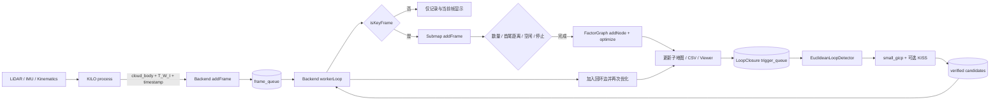
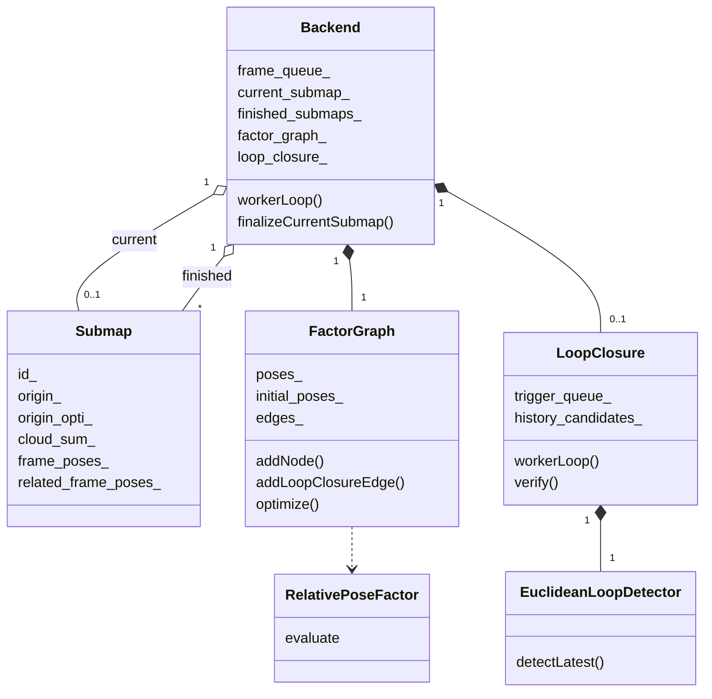
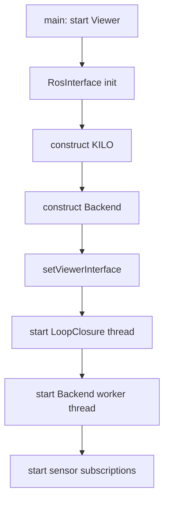
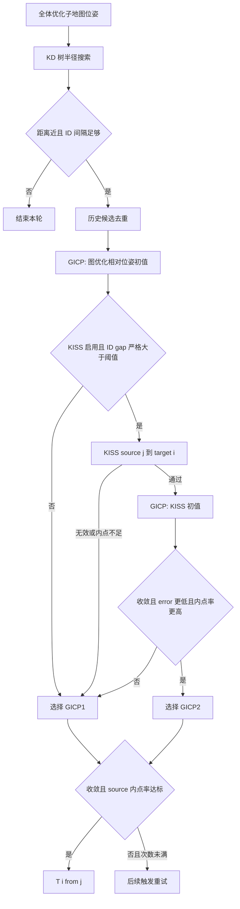
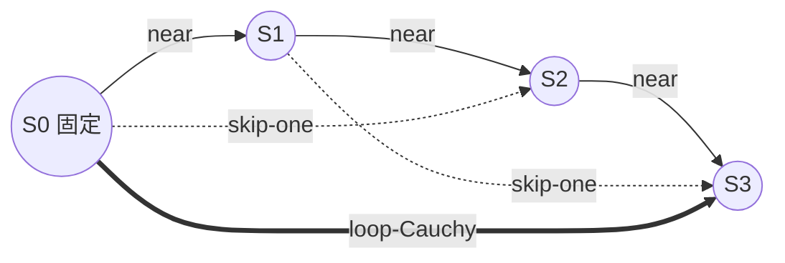
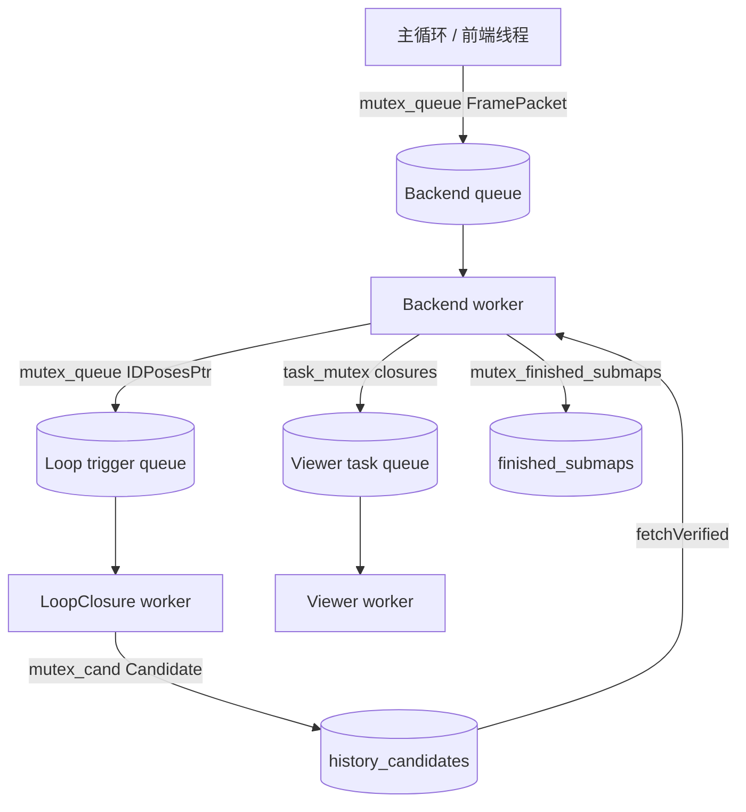

# kilo-map SLAM 后端源码学习指南

> 本文以当前仓库源码为唯一依据，面向会 C++、正在学习 SLAM 后端的读者。文中的“后端”专指 `legkilo/src/core/slam/backend/`，不是网络服务后端。
>
> 源码引用均相对于 `src/kilo-map/`。阅读基线包括 `README_CN.md`、ROS 1/ROS 2 入口、前端输出、后端四个核心模块、Viewer 和结果保存模块；不以 `build/`、`install/`、`log/` 或无关第三方源码为依据。

## 0. 先读结论：一条闭环主链

kilo-map 后端的最短完整链路是：

1. ROS 主循环调用 `KILO::process()`，得到 IMU/机体坐标系点云 `cloud_body` 和前端 IMU 位姿 $T_{W\leftarrow I}$。
2. `Backend::addFrame()` 把点云、位姿、时间戳和匹配类型放入无界队列。
3. `Backend::workerLoop()` 异步取帧，记录每个有效前端帧，只把关键帧加入当前 `Submap`。
4. 子地图达到关键帧数、首尾位移阈值，或队列空闲超时/停止时完成：点云降采样、保存 PCD、建立因子图节点。
5. `FactorGraph` 为新节点加入相邻和跨一节点的前端里程计约束，然后用 Ceres 优化。
6. 完成子地图的优化位姿送入 `LoopClosure` 线程；欧氏距离检测器搜索候选，small_gicp 验证，KISS-Matcher 可选地提供第二个初值。
7. 已验证回环由后端线程取回，加入 Cauchy 鲁棒核回环边，再次优化。
8. 优化结果回写 `Submap::origin_opti_`，更新运行期 CSV、Viewer 和后续地图/轨迹导出；**不会回写前端 ESKF**。



源码依据：

- 前端入口：`legkilo/src/interface/ros1/ros_interface.cc` 与 `legkilo/src/interface/ros2/ros_interface.cc`，`RosInterface::run()`。
- 后端主控：`legkilo/src/core/slam/backend/backend.{h,cc}`，`Backend`。
- 子地图：`legkilo/src/core/slam/backend/submap.{h,cc}`，`Submap`。
- 回环：`legkilo/src/core/slam/backend/loop_closure/loop_closure.{h,cc}`，`LoopClosure`。
- 候选检测：`legkilo/src/core/slam/backend/loop_closure/loop_detector/euclidean_method.{h,cc}`。
- 因子图与残差：`legkilo/src/core/slam/backend/factor_graph/`。

**本章要点**

- 后端以“子地图原点”为图节点，不以每个激光帧或每个关键帧为图节点。
- 回环检测和后端消费分别运行在线程中，结果通过队列/候选表传递。
- 后端修正用于显示和导出，不闭环反馈到在线前端状态。

**自测**

1. 因子图节点对应一帧、关键帧还是子地图？
2. 回环成功后，前端 ESKF 的位姿会被改写吗？

---

## 1. 学习目标、前置知识与范围

### 1.1 学完应能回答

- 一帧前端结果在哪个线程进入后端，又在哪个线程被消费？
- 为什么只有关键帧进入子地图，而运行期文件仍能保存所有有效前端帧？
- 子地图 PCD 属于哪个坐标系，如何由优化位姿放到全局坐标系？
- 回环测量到底是 $T_{i\leftarrow j}$ 还是它的逆？
- `RelativePoseFactor` 的 6 维残差分别是什么，测量和估计的组合顺序是什么？
- Ceres 优化后哪些对象被更新，哪些对象明确没有被更新？
- 停止时队列如何清空，最后一个子地图和最后一次回环是否一定完成？
- YAML 中哪些键在当前配置文件里存在，哪些只依赖代码默认值，哪些读了却没有生效？

### 1.2 建议前置知识

- C++17：智能指针、RAII、`std::thread`、互斥锁、条件变量、原子变量。
- Eigen：`Isometry3d`、旋转矩阵、四元数、左乘变换。
- 点云配准：target/source、ICP/GICP、内点率。
- 图优化：节点、相对位姿边、信息矩阵、鲁棒核、规范自由度（gauge freedom）。
- ROS 主循环与回调线程的基本概念。

### 1.3 范围边界

本文详细解释后端真实调用到的前端输出、small_gicp、KISS-Matcher、Viewer 和保存接口；不展开 ESKF 推导、第三方库全部实现或 ROS 驱动细节。算法原理只讲到足以逐项对应本项目代码的程度。

**本章要点**

- 学习重点是“代码实际怎样做”，不是泛化的 SLAM 教科书流程。
- 第三方库只为核对输入输出方向和本项目参数而阅读。

**自测**

1. 阅读本文前最重要的 Eigen 变换知识是什么？
2. 为什么需要同时阅读 ROS 入口和结果保存模块？

---

## 2. 后端职责、输入与输出

### 2.1 输入来自哪里

ROS 1 和 ROS 2 的实现相同：

- `RosInterface::run()` 调用 `KILO::process(measure_)`。
- 仅当 `ProcessResult::valid == true` 时才调用后端。
- 传入：
  - `process_result.cloud_body`；
  - `makeIsometry3d(kilo_->getRotImu(), kilo_->getPosImu())`；
  - 激光扫描结束时间；
  - `process_result.match_types`。

源码：`legkilo/src/interface/ros1/ros_interface.cc::RosInterface::run()`、`legkilo/src/interface/ros2/ros_interface.cc::RosInterface::run()`。

`KILO::process()` 证明了坐标语义：

- 外参注释定义 $T_{I\leftarrow L}$，即 LiDAR 点变到 IMU/机体系；
- 第一帧以 `T_I_L` 把 `cloud_down_lidar` 变为 `cloud_down_body`；
- 后续帧把世界点云左乘当前 IMU 位姿的逆，得到 `cloud_down_body`；
- `getRotImu()/getPosImu()` 构成 $T_{W\leftarrow I}$。

源码：`legkilo/src/core/slam/frontend/KILO.cc::KILO::process()`、`KILO::initializeMap()`；配置注释见 `legkilo/config/*.yaml::extrinsic_T/extrinsic_R`。

因此后端输入点满足：

$$
\mathbf p_W=T_{W\leftarrow I_k}\mathbf p_{I_k}
$$

### 2.2 后端负责什么

- 从所有有效前端帧中选择关键帧。
- 把关键帧点云累计到子地图局部坐标系。
- 管理子地图完成、降采样、保存和内存释放。
- 以子地图为节点建立增量因子图。
- 生成并验证回环约束。
- 执行全局位姿优化。
- 更新 Viewer、运行期记录和离线导出所需数据。

### 2.3 输出去向

1. **内存**
   - `Submap::origin_opti_` 保存优化子地图位姿。
   - `FactorGraph::poses_` 保存 Ceres 参数块。
2. **运行期目录**
   - `result/<temp_result_save_folder>/submap_<id>.pcd`
   - `frontend_frames.csv`
   - `submaps.csv`
   - `loop_edges.csv`
   - `factor_graph.g2o`
   - 配置快照 `config.yaml`
3. **Viewer**
   - 当前帧点云与轨迹；
   - 已完成子地图、优化轨迹和回环连线。
4. **离线保存**
   - `SLAMResultSaver` 按优化子地图原点重建后端轨迹与全局地图。
5. **ROS 2 外部子地图发布器**
   - `BackendSubmapPublisher` 监视 `submaps.csv`，加载局部 PCD，以优化位姿变换后发布。

源码：`legkilo/src/core/slam/tool/slam_result_recorder.h`、`slam_result_saver.cc`、`legkilo/src/apps/backend_submap_publisher_ros2.cc`。

### 2.4 明确不负责的事

- 不修改前端 `ESKF` 状态。
- 不改变在线 ROS 里程计/TF 发布；它们仍直接使用 `KILO` 前端位姿。
- 不对当前未完成子地图做图优化。
- 不使用 IMU 预积分因子、GPS 因子或每关键帧图节点；当前图只有子地图相对位姿边。

**本章要点**

- 输入点云在 IMU/机体系，输入位姿是 IMU 到世界的绝对前端位姿。
- 输出分为子地图图优化状态、运行期文件、Viewer 和离线导出。
- “后端轨迹”是导出时按子地图修正重建的，不是回写后的在线前端轨迹。

**自测**

1. `cloud_body` 和传入 `pose` 分别属于什么坐标语义？
2. ROS 实时发布的 odometry 是前端值还是后端值？
3. 运行期 PCD 和 `submaps.csv` 如何配合恢复全局地图？

---

## 3. 源码目录、核心类和数据关系

### 3.1 目录速查

- `legkilo/src/core/slam/backend/backend.{h,cc}`：总调度、关键帧、线程、子地图提交、优化回写。
- `legkilo/src/core/slam/backend/submap.{h,cc}`：局部点云和帧位姿。
- `legkilo/src/core/slam/backend/loop_closure/loop_closure.{h,cc}`：候选历史、异步验证、已验证回环。
- `legkilo/src/core/slam/backend/loop_closure/loop_detector/euclidean_method.{h,cc}`：基于优化原点位置的 KD 树半径搜索。
- `legkilo/src/core/slam/backend/factor_graph/factor_graph.{h,cc}`：Ceres 问题、节点和边。
- `legkilo/src/core/slam/backend/factor_graph/ceres_factor.h`：`RelativePoseFactor`。
- `legkilo/src/core/slam/backend/factor_graph/graph_utils.h`：位姿参数、四元数流形、无序边键。
- `legkilo/src/core/slam/tool/slam_result_recorder.h`：运行期记录。
- `legkilo/src/core/slam/tool/slam_result_saver.{h,cc}`：轨迹和地图导出。
- `legkilo/src/viewer/viewer_slam_interface.{h,cc}`：后端结果可视化。

### 3.2 关键数据结构

- `Backend::FramePacket`
  - `CloudPtr cloud`
  - `Eigen::Isometry3d pose`
  - `double timestamp`
  - `LidarMatchTypesPtr match_types`
- `Submap`
  - `origin_`：首个关键帧的前端绝对位姿。
  - `origin_opti_`：对应图节点的优化绝对位姿。
  - `related_frame_poses_`：关键帧相对子地图原点的位姿。
  - `frame_poses_`：关键帧前端绝对位姿。
  - `cloud_sum_`：子地图局部点云。
- `LoopClosure::Candidate`
  - 节点 `i/j`、尝试次数、有效/已取标志、配准测量 `meas`。
  - `fitness_score` 和 `kiss_inliers` 字段当前没有被写入或用于决策。
- `graph::PoseParam`
  - 平移数组 `t[3]`；
  - 四元数数组 `q[4]`，内存顺序 `x,y,z,w`。
- `FactorGraph::StoreEdge`
  - 用于 G2O 导出的边、测量和平方根信息矩阵。



### 3.3 ID 与索引不变量

`Submap::generateGlobalId()` 使用函数内静态 `global_id++`。`LoopClosure::workerLoop()` 用 `cur_input->at(ij.first/second)`，实际上把节点 ID 当成 `IDPoses` 的数组索引；这依赖“完成子地图 ID 从 0 连续且向量按 ID 排序”这一不变量。`finished_submaps_` 是 `std::map`，在没有跳号的首次运行中按 ID 迭代，能够满足该前提。

但当前实现有两条可破坏此前提的源码路径：

1. 子地图在关键帧判断前创建；若它只收到非关键帧便因空闲/停止被完成，会作为空子地图丢弃，但 ID 已消耗。之后完成子地图的 ID 会出现缺口。
2. 如果同一进程销毁并重建 `Backend`，静态 ID 不会复位，而新的 `IDPoses` 从第 0 个元素开始存储。

一旦候选节点 ID 大于等于 `IDPoses::size()`，`at(node_id)` 会抛 `std::out_of_range`。当前主程序通常只构建一次后端，但“空子地图消耗 ID”可在同一生命周期内由数据暂停触发，因此不能把连续 ID 当作无条件保证。

**本章要点**

- `Backend` 是所有模块的编排者；`Submap` 是图节点和局部 PCD 的桥梁。
- `origin_` 与 `origin_opti_` 的分离是后端修正不破坏前端原始轨迹的关键。
- 回环代码隐含“节点 ID 等于向量索引”的前提。

**自测**

1. `related_frame_poses_` 与 `frame_poses_` 的区别是什么？
2. 哪两条路径会破坏“节点 ID 等于位姿向量索引”的假设？
3. 哪个对象真正持有 Ceres 参数块？

---

## 4. 初始化、启动与停止

### 4.1 对象创建顺序

主程序先构建并启动 `ViewerSlamInterface`，再构建 `RosInterface`。`RosInterface::initParamAndReset()`/`init()` 内：

1. 创建前端 `KILO`；
2. 创建 `Backend(config_file)`；
3. 设置裸指针 `Backend::setViewerInterface(viewer_interface_)`；
4. 调用 `Backend::start()`；
5. 初始化预处理和 ROS 订阅线程。

源码：`legkilo/src/apps/leg_kilo_node{,_ros2}.cc`，`legkilo/src/interface/ros1/ros_interface.cc`，`legkilo/src/interface/ros2/ros_interface.cc`。

### 4.2 `Backend` 构造

`Backend::Backend()`：

- 读取关键帧、子地图和空闲超时配置；
- 构造临时结果目录 `ROOT_DIR/result/<folder>/`；
- **清空该目录已有内容**；
- 设置 `Submap` 静态 PCD 保存目录；
- 初始化 `SLAMResultRecorder` 并复制 YAML 快照；
- 创建 `FactorGraph`；
- 仅当 `loop_closure_enable=true` 时创建 `LoopClosure`。

源码：`legkilo/src/core/slam/backend/backend.cc::Backend::Backend()`。

### 4.3 启动

`Backend::start()` 先启动回环线程，再启动后端工作线程。这样后端首个完成子地图提交回环任务时，消费者已经存在。



### 4.4 正常停止

`RosInterface::stopSlam()` 先停止订阅/执行器并 join 传感器线程，再调用 `backend_->stop()`。因此正常路径不会在后端已退出后继续 `addFrame()`。

`Backend::stop()`：

1. 原子设置 `stopping_=true`；
2. 唤醒条件变量；
3. join 后端线程；
4. 再停止并 join 回环线程。

后端线程被停止信号唤醒后仍会交换并处理当时队列中的全部帧，完成当前子地图，取一次已验证回环，刷新 Viewer，写出记录，然后退出。

### 4.5 停止边界的重要限制

最后一个子地图完成时会向回环线程新提交任务，但后端线程紧接着只取一次当前已验证结果并退出；随后 `Backend::stop()` 才停止回环线程。`LoopClosure::workerLoop()` 看到停止标志后会直接退出，即使刚取到触发输入也不再检测。因此：

- 已排队前端帧和当前非空子地图会被收尾；
- **最后一次新触发的回环检测/验证不保证在关闭前完成或被应用**；
- 回环线程在后端最后一次 `fetchVerified()` 之后新产出的结果也不会被应用。

这是停止顺序的实际语义，不应假设“stop 会等待最后一次回环完整收敛”。

**本章要点**

- Viewer 先于后端启动，订阅线程先于后端停止。
- 后端停止会排空帧队列并完成非空子地图。
- 停止不保证处理最后一次异步回环任务。

**自测**

1. 为什么 `Backend::stop()` 要先 join 后端线程再停止回环线程？
2. 最后一个子地图的 PCD 会保存吗？它触发的回环一定会应用吗？
3. 构造 `Backend` 对临时结果目录有什么副作用？

---

## 5. 单帧主流程与关键帧判断

### 5.1 入队

`Backend::addFrame()` 对空指针或空点云直接返回；否则在 `mutex_queue_` 下把 `FramePacket` 放到 `frame_queue_` 尾部并通知工作线程。

队列没有容量上限、丢帧或背压机制。若后端长期慢于前端，内存占用可以持续增长；工作线程发现帧时会用 `swap` 一次取走整个批次，缩短持锁时间。

### 5.2 工作线程处理顺序

对批次中的每帧，`Backend::workerLoop()` 按以下顺序执行：

1. 如果没有当前子地图，先创建 `Submap`。
2. 调用 Viewer 的 `insertCurrentKeyframe()`。
3. 调用 `isKeyFrame(current_pose)`。
4. `SLAMResultRecorder::recordFrontendFrame(...)` 记录该帧及关键帧标志。
5. 非关键帧直接 `continue`。
6. 关键帧调用 `current_submap_->addFrame()`。
7. 检查子地图是否完成。

注意：Viewer 方法名叫 `insertCurrentKeyframe()`，但调用发生在关键帧判断之前，所以**每个有效后端输入帧都会进入 Viewer 的“当前关键帧”容器**。这是实现行为与命名不一致之处。真正进入 `Submap` 的仍只有关键帧。

### 5.3 关键帧判据

第一帧无条件成为关键帧，并设置 `last_kf_pose_`。之后：

$$
T_{\text{last}\leftarrow\text{current}}
=T_{W\leftarrow\text{last}}^{-1}T_{W\leftarrow\text{current}}
$$

- 平移差：`relative_pose.translation().norm()`；
- 旋转差：`AngleAxisd(relative_pose.rotation()).angle()`，转换为度；
- 平移 **严格大于** `kf_trans_threshold`，或旋转 **严格大于** `kf_degree_threshold`，成为关键帧。

只有判为关键帧时才更新 `last_kf_pose_`。阈值比较不是 `>=`。

源码：`legkilo/src/core/slam/backend/backend.cc::Backend::isKeyFrame()`。

### 5.4 跨子地图细节

`last_kf_pose_` 是整个后端生命周期的上一关键帧，不在新子地图开始时重置。因此新子地图的首个接收帧不一定是关键帧：

- 后端仍会先创建一个带新 ID 的空子地图；
- 该非关键帧会被记录为属于这个新子地图；
- 直到某帧超过相对上一关键帧阈值，才成为该子地图真正首帧并设置原点；
- 若空闲/停止发生且始终没有关键帧，`finalizeCurrentSubmap()` 会丢弃空子地图。

这种情况下，已记录的非关键帧可能引用一个最终不存在于 `submaps.csv` 的子地图 ID，`SLAMResultSaver::buildBackendTrajectory()` 会跳过它并告警缺失子地图。

### 5.5 空队列与空闲完成

工作线程用 `cv_.wait_for(idle_timeout, predicate)`：

- 有帧或停止时，谓词为真，返回非超时；
- 没有帧直到超时，`timed_out=true`；
- 超时会尝试完成当前子地图；
- 若没有当前子地图，或当前子地图为空，则无有效提交。

默认超时 1 秒，且构造时最小夹到 0.1 秒。播放 bag 时的暂停也可能提前切断子地图。

**本章要点**

- 所有有效帧都记录，只有关键帧累计进子地图。
- Viewer 的 `insertCurrentKeyframe` 实际接收所有有效帧。
- 关键帧基准跨子地图延续，新子地图可能先经历若干非关键帧。
- 队列无界，空闲超时会主动完成子地图。

**自测**

1. 位移恰好等于阈值时会成为关键帧吗？
2. 为什么新建子地图可能为空并被丢弃？
3. Viewer 当前轨迹中的点是否严格等于后端关键帧？
4. 后端拥堵时是否会自动丢旧帧？

---

## 6. 子地图机制与坐标系

### 6.1 统一变换记号

本文采用：

$$
T_{A\leftarrow B}:\quad \mathbf p_A=T_{A\leftarrow B}\mathbf p_B
$$

即下标右侧坐标系的点被变换到左侧坐标系。令：

- $W$：前端世界坐标系，ROS 中通常标为 `camera_init`；
- $I_k$：第 $k$ 帧 IMU/机体坐标系；
- $S$：当前子地图局部坐标系，等于其首个关键帧的 IMU 坐标系；
- $P_k=T_{W\leftarrow I_k}$：前端绝对位姿。

### 6.2 原点与相对位姿

首个关键帧进入空子地图时：

$$
T_{W\leftarrow S}=\texttt{origin\_}=P_0
$$

并初始化：

$$
\texttt{origin\_opti\_}=P_0
$$

任意关键帧的局部相对位姿：

$$
T_{S\leftarrow I_k}
=T_{W\leftarrow S}^{-1}T_{W\leftarrow I_k}
=\texttt{origin\_.inverse() * pose}
$$

`Submap::addFrame()` 用该变换把当前 `cloud_body` 从 $I_k$ 变到 $S$，再累加到 `cloud_sum_`。因此保存的 `submap_<id>.pcd` 是**子地图首关键帧 IMU 坐标系下的局部点云**。

源码：`legkilo/src/core/slam/backend/submap.cc::Submap::addFrame()`。

### 6.3 两套帧位姿

- `related_frame_poses_` 保存 $T_{S\leftarrow I_k}$，用于局部关系和首尾距离。
- `frame_poses_` 保存原始 $T_{W\leftarrow I_k}$，用于 Viewer 在优化后重建子地图内轨迹。

优化后第 $k$ 帧显示/导出位姿为：

$$
T^{\text{backend}}_{W\leftarrow I_k}
=T^{\text{opti}}_{W\leftarrow S}T_{S\leftarrow I_k}
$$

Viewer 采用等价写法：

```text
submap_pose * keyframe_poses.front().inverse() * keyframe_pose
```

源码：`legkilo/src/viewer/viewer_slam_interface.cc::refreshDrawables()`。

### 6.4 完成条件

`Backend::isSubmapFinished()` 使用逻辑或：

- 关键帧数 `>= kf_max_num_submap`；
- 首尾关键帧平移距离 `>= kf_max_dist_submap`。

另有两种外部触发：

- 队列空闲超时；
- 后端停止。

首尾距离不是累计路程。若机器人绕一圈回到子地图起点附近，距离可能很小，只能由关键帧数或超时结束。

### 6.5 完成、保存和释放

`finalizeCurrentSubmap()` 对非空子地图固定调用：

```text
current_submap_->setFinished(true, 0.1)
```

实际行为：

1. `finished_=true`；
2. 使用项目自定义 `VoxelGrid` 和 `MedianRepresentative` 模式，以固定 0.1 m 分辨率降采样；
3. 二进制压缩保存 PCD；
4. 加入 `finished_submaps_`；
5. Viewer 另以固定 0.1 m 再滤一次用于显示；
6. 图优化和结果同步后 `releaseCloud()` 释放内存。

之后 `Submap::getCloud()` 可通过 `loadPCD()` 懒加载回来。保存失败只记录告警/返回 false，`finalizeCurrentSubmap()` 不检查返回值，仍继续建图；此时回环加载 PCD 会失败。

### 6.6 源码注释差异

当前 YAML 对 `kf_max_num_submap` 的注释是“max number of submaps to maintain”，但实现把它用于**单个子地图内最多关键帧数**，不限制内存中已完成子地图的数量。应以 `Backend::isSubmapFinished()` 为准。

**本章要点**

- 子地图坐标系固定为首关键帧 IMU/机体系。
- PCD 是局部点云，必须左乘优化子地图原点才能进入世界系。
- 距离完成条件是首尾直线距离，不是行驶总路程。
- 完成降采样分辨率 0.1 m 是硬编码，不是 YAML 参数。

**自测**

1. 为什么 PCD 中的点不能直接当作世界坐标？
2. 写出第 $k$ 帧从前端位姿变为后端位姿的公式。
3. 机器人在小范围绕圈时哪个子地图完成条件更可能先触发？
4. `kf_max_num_submap` 的 YAML 注释哪里不准确？

---

## 7. 回环候选、验证与测量方向

### 7.1 何时触发

每个非空子地图完成并完成一次因子图优化后，`Backend::finalizeCurrentSubmap()` 收集所有已完成子地图的优化位姿，调用 `LoopClosure::insert(optimized_poses)`。

触发队列若积压，回环线程只取最新一份并清空旧份，因为每份都包含所有已完成子地图，旧快照可以被新快照覆盖。积压超过 1 会记录告警。

回环优化后本身不会立即再触发候选检测；要等下一子地图完成时，新的全体优化位姿才再次进入回环线程。

### 7.2 欧氏候选检测

`EuclideanLoopDetector::detectLatest()` 虽名为 “Latest”，实际会：

1. 对输入的**全部**优化子地图平移建立 3D KD 树；
2. 对每个子地图做半径搜索；
3. 只输出满足 $id_i < id_j$ 且
   \[
   id_j - id_i \ge \texttt{loop\_min\_id\_separation}
   \]
   的配对。

距离阈值是优化后原点之间的三维欧氏距离。搜索半径最小被夹到 0.1 m，ID 间隔最小被夹到 1。

候选以 `UnorderedIntPairKey` 去重。历史表中的成功候选不再验证；失败候选在 `attempts < loop_verify_max_attempts` 时会在后续触发中重试。

### 7.3 初值

新候选的初值：

$$
\widetilde T^{(0)}_{i\leftarrow j}
=T_{W\leftarrow i}^{-1}T_{W\leftarrow j}
$$

源码写法为 `pose_i.inverse() * pose_j`。失败验证仍会把 GICP 输出写回 `Candidate::meas`，所以下一次尝试使用上次配准结果，而不是重新读取更新后的优化位姿。已有候选的初值不会因后续图优化自动刷新。

### 7.4 target/source 与方向核对

`LoopClosure::verify(i,j,...)`：

- `cloud_i` 作为 `target`；
- `cloud_j` 作为 `source`；
- small_gicp 返回 `T_target_source`；
- 第三方接口注释和实现均表明它把 source 点变到 target：
  \[
  \mathbf p_i=T_{\text{target}\leftarrow\text{source}}\mathbf p_j
  \]

因此输出：

$$
\boxed{\texttt{meas}=T_{i\leftarrow j}}
$$

它与 `pose_i.inverse()*pose_j`、因子预测 $P_i^{-1}P_j$ 完全一致。代码注释“relative pose from i to j”容易被口语化误读；准确含义是“**j 坐标表示变换到 i 坐标**”或“j 在 i 中的位姿”。

方向证据：

- 本项目调用：`legkilo/src/core/slam/backend/loop_closure/loop_closure.cc::verify()`。
- small_gicp API：`legkilo/thirdparty/smallgicp/small_gicp/registration/registration_helper.hpp` 的 `T_target_source`。
- KISS 求解器：`dst - R*src` 和 `solveForTranslation(R*src,dst)`，证明返回满足 $\mathbf p_{tgt}=R\mathbf p_{src}+t$。

### 7.5 small_gicp 验证

每次验证：

1. 从磁盘加载两个局部子地图 PCD；
2. 各建 KD 树并用 10 近邻估计协方差；
3. 用图优化相对位姿初值运行 GICP；
4. 设置：
   - 最大对应距离平方；
   - 统计内点的距离阈值平方；
   - 最大迭代次数；
5. 最终接受条件只有：
   - `selected_result.converged`；
   - `source_inlier_ratio >= loop_icp_fitness_threshold`。

没有额外的最大 `error` 阈值、平移/旋转改变量阈值或几何一致性检查。配置名 `fitness_threshold` 实际比较的是 source inlier ratio。

### 7.6 KISS-Matcher 的真实角色

仅当：

- `loop_kiss_matcher_enabled=true`；
- `abs(i-j) > loop_kiss_refine_min_id_gap`（严格大于）；

才运行 KISS。调用 `matcher.estimate(source_vec, target_vec)`，因此其解同样是 $T_{i\leftarrow j}$。

KISS 通过条件是解有效且最终内点数达到阈值。通过后只把 KISS 解作为**第二次 GICP 初值**。第二次结果必须：

- 收敛；
- 且相对第一次同时具有更低 `error` 和更高 source inlier ratio；

才会被选中。KISS 失败不直接否决第一次 GICP；KISS 成功也不直接接受回环，最终仍由选中的 GICP 收敛和内点率决定。

KISS 的体素大小固定为 0.3 m，不从 YAML 读取。

### 7.7 失败重试和结果获取

- 验证耗时阶段不持有 `mutex_cand_`，先复制待验证候选，完成后再加锁回写。
- 候选验证顺序来自 `unordered_map`，不保证确定顺序。
- 每次尝试，无论成功失败，`attempts += 1`。
- 成功候选由 `fetchVerified()` 返回一次并设置 `fetched=true`。
- 失败达到上限后永久停止重试。



**本章要点**

- 候选搜索使用全部优化子地图原点，不只搜索最新节点。
- 回环测量是 $T_{i\leftarrow j}$：把子地图 j 的局部点变到 i。
- KISS 只提供可选第二初值，最终门槛仍是 GICP。
- 失败候选复用上次配准输出，且初值不会随图优化自动刷新。

**自测**

1. `pose_i.inverse()*pose_j` 把哪个坐标系的点变到哪个坐标系？
2. KISS 内点数不足时，第一次 GICP 还能接受吗？
3. `loop_kiss_refine_min_id_gap=100` 时，ID 差恰好 100 会运行 KISS 吗？
4. 为什么 `detectLatest()` 这个名字不能准确描述当前实现？

---

## 8. 因子图：节点、边、权重与求解

### 8.1 节点

每个完成子地图对应一个 `FactorGraph` 节点。`addNode(id, initial_pose)`：

- 在 `initial_poses_` 永久保存前端子地图原点；
- 在 `poses_` 创建可优化 `PoseParam`；
- 向 Ceres 添加 3 维平移和 4 维四元数参数块；
- 给四元数绑定 `EigenQuaternionManifold`（Ceres 2）或旧版参数化；
- 第一个节点的平移和旋转都设为常量，固定全部 6 自由度，消除全局规范自由度。

重复 ID 会直接返回。

### 8.2 里程计边

每加一个新节点：

- 若至少 2 个节点，增加“上一节点 → 新节点”边；
- 若至少 3 个节点，再增加“上上节点 → 新节点”的跨一节点边。

两者测量均由**冻结的前端初始原点**计算：

$$
\widetilde T_{i\leftarrow j}
=(T^{frontend}_{W\leftarrow i})^{-1}T^{frontend}_{W\leftarrow j}
$$

不是用当前优化位姿重新生成测量。跨一节点边不是两个相邻边的动态组合，而是前端绝对位姿直接相减得到的独立约束。

近邻边默认标准差：

- 平移 0.1 m；
- 旋转 5°。

跨一节点边默认把标准差分别乘 2，因此权重更低。

### 8.3 回环边

`addLoopClosureEdge(i,j,meas)`：

- 用无序节点对去重；
- 任一节点不存在则忽略；
- 平移标准差 = 近邻平移标准差 × 10；
- 旋转标准差 = 近邻旋转标准差 × 4；
- 使用 `ceres::CauchyLoss(scale=3.0)`。

默认值意味着回环标准差为 1.0 m 和 20°，明显低于近邻里程计信任度。这里没有使用 GICP Hessian、协方差、内点率或 error 来自适应设置回环信息。

### 8.4 平方根信息矩阵

`MakeSqrtInformation()` 生成对角阵：

$$
S=\operatorname{diag}\left(
\frac1{\sigma_t},\frac1{\sigma_t},\frac1{\sigma_t},
\frac1{\sigma_R},\frac1{\sigma_R},\frac1{\sigma_R}
\right)
$$

其中旋转标准差先从度转为弧度。残差最终左乘 $S$，所以对应信息矩阵为：

$$
\Omega=S^\mathsf TS
$$

默认数值：

- 近邻：平移权重 $1/0.1=10$，旋转权重 $1/(5\pi/180)\approx11.46$；
- 跨一节点：5 和约 5.73；
- 回环：1 和约 2.86，再叠加 Cauchy 鲁棒核。

代码没有对零或负标准差做保护；零会产生无穷权重，负值虽平方目标可能仍为正，但语义错误。配置必须保持正数。

### 8.5 增量问题与求解器

`ceres::Problem` 在 `FactorGraph` 构造时创建，后续节点和残差持续追加，不会每次重建。`optimize()`：

- 最大迭代默认 100；
- `SPARSE_NORMAL_CHOLESKY`；
- `num_threads=1`，避免 Ceres 多线程非确定性；
- 不向标准输出打印迭代过程；
- 每个子地图完成后优化一次；
- 每批已验证回环加入后再优化一次；
- 每次求解后覆盖写 `factor_graph.g2o`。

没有检查 `summary.IsSolutionUsable()`，日志只给迭代次数和最终 cost，随后无条件读取当前参数。

### 8.6 G2O 导出的注意事项

`saveG2o()` 给 `EDGE_SE3:QUAT` 写出的上三角数值来自 `edge.sqrt_information`，而标准 g2o 格式通常要求**信息矩阵 $\Omega$**，即此处应为 $S^\mathsf TS$。因此当前文件中的边权数值是平方根信息而非通常意义的信息矩阵；用外部 g2o 工具重优化时，权重会与 Ceres 内部目标不同。

这不影响当前 Ceres 优化，因为 Ceres 直接使用 `RelativePoseFactor` 内的 $S$，但会影响对 `factor_graph.g2o` 的解释。



**本章要点**

- 图节点是完成子地图，第一节点固定全部 6 自由度。
- 每个新节点最多新增一条相邻边和一条跨一节点边。
- 回环默认比近邻里程计权重低，并使用 Cauchy 核。
- G2O 当前写的是平方根信息，不是标准信息矩阵。

**自测**

1. 为什么必须固定第一个节点？
2. 默认回环平移标准差是多少？
3. 跨一节点边的测量来自当前优化位姿吗？
4. `factor_graph.g2o` 的边权为何不能直接等同 Ceres 信息矩阵？

---

## 9. `RelativePoseFactor` 数学与代码逐项对应

### 9.1 状态和测量

对边 $(i,j)$，优化状态：

$$
P_i=(R_i,p_i)=T_{W\leftarrow i},\qquad
P_j=(R_j,p_j)=T_{W\leftarrow j}
$$

测量：

$$
\widetilde T_{i\leftarrow j}
=(\widetilde R_{ij},\widetilde p_{ij})
$$

预测相对位姿：

$$
\widehat T_{i\leftarrow j}=P_i^{-1}P_j
$$

展开为：

$$
\widehat R_{ij}=R_i^\mathsf T R_j
$$

$$
\widehat p_{ij}=R_i^\mathsf T(p_j-p_i)
$$

### 9.2 参数映射

`RelativePoseFactor::operator()` 的参数顺序由 `AddResidualBlock()` 确定：

1. `it_i->second.t` → $p_i$
2. `it_i->second.q` → $q_i$
3. `it_j->second.t` → $p_j$
4. `it_j->second.q` → $q_j$

`Eigen::Map<const Eigen::Quaternion<T>>` 按 Eigen 系数布局读取 `x,y,z,w`，与 `PoseParam::q[4]` 以及 `EigenQuaternionManifold` 一致。

### 9.3 预测值

代码：

```text
q_a_inverse = q_a.conjugate()
q_ab_estimated = q_a_inverse * q_b
p_ab_estimated = q_a_inverse * (p_b - p_a)
```

逐项对应：

$$
\widehat q_{ij}=q_i^{-1}\otimes q_j
$$

$$
\widehat p_{ij}=R_i^\mathsf T(p_j-p_i)
$$

这里四元数乘向量执行旋转。

### 9.4 平移残差

代码：

$$
e_t=\widehat p_{ij}-\widetilde p_{ij}
$$

即“预测减测量”。

### 9.5 旋转残差方向

代码先算：

$$
\delta q
=\widetilde q_{ij}\otimes\widehat q_{ij}^{-1}
$$

再取：

$$
e_R=2\,\operatorname{vec}(\delta q)
$$

所以旋转部分是“测量乘预测的逆”，不是 `estimated * measured.inverse()`，也不是完整 SO(3) 对数映射。零残差条件仍是 $\widetilde q_{ij}=\widehat q_{ij}$。在小角度附近，二倍虚部近似旋转误差向量。

平移用“预测减测量”，旋转用“测量乘预测逆”；两块符号约定不同。当前 $S$ 为对角阵、目标按残差平方计算，零点和各块独立代价不受整体符号影响，但调试雅可比或换成非对角相关信息矩阵时必须按源码方向理解。

### 9.6 加权和鲁棒代价

拼接：

$$
e=
\begin{bmatrix}
e_t\\
e_R
\end{bmatrix}
$$

最终残差：

$$
r=Se
$$

总优化目标可写为：

$$
\min_{\{P_k\}}\sum_{e\in\mathcal E_{\text{odom}}}\|r_e\|^2
+\sum_{e\in\mathcal E_{\text{loop}}}
\rho_{\text{Cauchy}}\!\left(\|r_e\|^2\right)
$$

其中 Ceres 的 Cauchy 损失尺度来自 `loopclosure_loss_scale`。里程计边传入空 loss，使用普通平方损失。

### 9.7 一个方向验算

设 $P_i$ 是世界原点，$P_j$ 在 i 的 x 正方向 2 m，姿态相同：

$$
P_i=I,\qquad
P_j=
\begin{bmatrix}
I & [2,0,0]^\mathsf T\\
0&1
\end{bmatrix}
$$

则：

$$
P_i^{-1}P_j=T_{i\leftarrow j}
$$

其平移为 $[2,0,0]$。j 局部原点 $[0,0,0]$ 变到 i 中正好是 $[2,0,0]$。若 GICP target=i、source=j，也应输出同一方向。若误把回环取逆，测量平移会是 $[-2,0,0]$，因子在正确状态下产生 4 m 的未加权平移误差，立刻暴露方向错误。

**本章要点**

- 因子预测与回环配准都使用 $T_{i\leftarrow j}=P_i^{-1}P_j$。
- 平移残差是预测减测量。
- 旋转误差是 $q_{meas}\otimes q_{est}^{-1}$ 的二倍虚部。
- 位姿参数四元数内存顺序是 `x,y,z,w`。

**自测**

1. 写出 `p_ab_estimated` 对应的矩阵公式。
2. 代码中的 `delta_q` 是哪两个四元数按什么顺序相乘？
3. 为什么 target=i、source=j 的 GICP 输出可以直接加入 $(i,j)$ 因子？
4. 四元数参数为什么需要流形而不能直接无约束优化四个分量？

---

## 10. 优化结果如何回写、显示与保存

### 10.1 每次优化后的统一回写

无论是新子地图后的优化，还是加入回环后的优化，`Backend` 都：

1. 在 `mutex_finished_submaps_` 下遍历全部已完成子地图；
2. `factor_graph_->getPose(id, optimized_pose)`；
3. `submap->updateOriginOpti(optimized_pose)`；
4. 生成 `IDPoses`；
5. `updateRecordedSubmaps()`；
6. `viewer_interface_->updateFinishedSubmapPose(optimized_poses)`。

新子地图完成路径还会把这份位姿提交给回环线程；回环优化路径不会立即再次提交。

### 10.2 运行期记录

`SLAMResultRecorder` 保存：

- `frontend_frames.csv`：所有有效后端输入帧、时间、子地图 ID、关键帧标志、前端 IMU 位姿；
- `submaps.csv`：PCD 路径、前端子地图原点、当前后端优化原点；
- `loop_edges.csv`：已被后端取回的验证回环；
- `config.yaml`：启动时配置快照。

每次子地图或回环优化后只刷新轻量的 `submaps.csv` 和 `loop_edges.csv`；停止时 `flush()` 才写 `frontend_frames.csv`。进程异常退出可能没有完整的前端帧文件。

这些静态容器没有内部锁，但当前正常调用均发生在后端工作线程；初始化发生在线程启动前。

### 10.3 Viewer 的变换

Viewer 的接口不是直接改 OpenGL 对象，而是通过 `ViewerBase::invoke()` 把闭包放入 `task_deque_`，由 Viewer 线程执行。闭包内部再用 `mutex_full_` 保护 Viewer 的 SLAM 数据。

已完成子地图：

- 点云模型矩阵直接设为 $T^{opti}_{W\leftarrow S}$；
- 子地图内轨迹使用
  \[
  T^{opti}_{W\leftarrow S}
  (T^{frontend}_{W\leftarrow S})^{-1}
  T^{frontend}_{W\leftarrow I_k}
  \]

当前未完成子地图/当前帧：

- Viewer 用最新完成子地图计算统一校正：
  \[
  T_{\text{backend}\leftarrow\text{frontend}}
  =T^{opti}_{W\leftarrow S_{last}}
  (T^{frontend}_{W\leftarrow S_{last}})^{-1}
  \]
- 再左乘当前前端位姿。

这只是显示层的刚体对齐，不修改前端或当前 `Submap` 内部数据。

### 10.4 后端轨迹重建

`SLAMResultSaver::buildBackendTrajectory()` 对每个记录帧：

$$
T_{S\leftarrow I_k}
=(T^{frontend}_{W\leftarrow S})^{-1}
T^{frontend}_{W\leftarrow I_k}
$$

$$
T^{backend}_{W\leftarrow I_k}
=T^{backend}_{W\leftarrow S}T_{S\leftarrow I_k}
$$

因此能给非关键帧也生成后端校正轨迹，前提是其 `submap_id` 最终存在。

### 10.5 全局地图

局部 PCD 在 $S$ 中；全局 IMU 坐标地图以 `backend_origin` 左乘每个点。ROS 2 `BackendSubmapPublisher` 明确实现：

$$
\mathbf p_W=T^{opti}_{W\leftarrow S}\mathbf p_S
$$

并周期监视 `submaps.csv` 修改时间。

### 10.6 不回写列表

以下状态不会因图优化改变：

- `KILO`/`ESKF` 的位置、旋转、协方差；
- ROS 在线 odom/TF；
- `Submap::origin_`；
- `Submap::frame_poses_` 和 `related_frame_poses_`；
- `Backend::last_kf_pose_`；
- 当前未完成子地图的原点。

**本章要点**

- 图优化只更新完成子地图的 `origin_opti_`。
- Viewer 和导出通过“优化原点 × 前端局部相对位姿”恢复帧级结果。
- Viewer 更新是投递到独立线程的异步闭包。
- 停止前 `frontend_frames.csv` 可能尚未落盘。

**自测**

1. 如何从两个子地图原点和原始帧位姿重建后端帧位姿？
2. 为什么当前帧在 Viewer 中能看起来跟随后端修正？
3. 哪些前端内部变量不会被图优化修改？
4. 异常退出时哪个运行期 CSV 最可能不完整？

---

## 11. 并发模型、锁边界与生命周期

### 11.1 主要线程

除 ROS 回调/执行器线程外，与后端直接相关的线程有：

1. 主循环线程：`RosInterface::run()` 和前端 `KILO::process()`，调用 `Backend::addFrame()`。
2. 后端工作线程：关键帧、子地图、Ceres、结果回写。
3. 回环工作线程：候选检测、PCD 加载、GICP/KISS 验证。
4. Viewer 线程：执行投递任务和渲染。
5. 第三方内部并行：small_gicp 使用 TBB reduction；不等同于显式的后端线程。



### 11.2 锁与保护对象

- `Backend::mutex_queue_`
  - 保护 `frame_queue_`；
  - `wait_for` 时由条件变量释放；
  - 批量 `swap` 后立刻解锁，实际处理不持锁。
- `Backend::mutex_finished_submaps_`
  - 保护 `finished_submaps_` 的插入、遍历和优化原点回写；
  - `updateRecordedSubmaps()` 在该锁内做文件状态更新和 `flushBackendState()`，锁持续时间可能包含磁盘写入。
- `LoopClosure::mutex_queue_`
  - 保护 `trigger_queue_`；
  - 只在取最新快照/清空时持有。
- `LoopClosure::mutex_cand_`
  - 保护 `history_candidates_`；
  - GICP/KISS 耗时验证不持锁。
- `ViewerBase::task_mutex_`
  - 保护闭包队列；
  - Viewer 当前实现持锁执行队列中的所有闭包，因此生产者在闭包执行期间可能暂时无法投递新任务。
- `ViewerSlamInterface::mutex_full_`
  - 保护已完成子地图、边、当前帧和绘制更新标志。

### 11.3 单线程所有权简化

- `current_submap_` 只由后端工作线程创建、修改和释放，不需要专门锁。
- `factor_graph_` 只由后端工作线程调用，Ceres `Problem` 不跨线程修改。
- `SLAMResultRecorder` 正常路径只由后端工作线程写。
- 回环线程不直接访问 `Submap` 对象，只从磁盘读已保存 PCD，避免对象级共享。

### 11.4 原子变量

- `Backend::stopping_`、`LoopClosure::stopping_` 使用 release/store 与 acquire/load。
- Viewer 的停止请求和 kill switch 使用原子布尔。
- ROS 接口 `slam_stopped_` 通过 `exchange` 保证停止只执行一次。

### 11.5 对象所有权

- `RosInterface` 用 `unique_ptr` 持有 `Backend`。
- `Backend` 用 `unique_ptr` 持有 `FactorGraph` 和可选 `LoopClosure`。
- 当前/已完成子地图用 `shared_ptr`。
- Viewer 在 `Backend` 中是非拥有裸指针；主程序的生命周期顺序保证先停止 ROS/Backend，再停止和销毁 Viewer。
- 帧点云和匹配类型以 `shared_ptr` 跨主线程、后端和 Viewer 闭包传递。
- `IDPosesPtr` 让优化位姿快照可安全跨后端、回环和 Viewer 队列存活。

### 11.6 边界风险

- `addFrame()` 不检查 `stopping_`；正常停止先关闭订阅，所以安全。若外部在后端退出后仍调用，帧会留在无人消费的队列。
- `start()` 没有重复启动保护；对已有 joinable 线程再次赋值不是安全用法。
- 队列无界，后端或回环持续落后会增加内存；回环队列通过“只保留最新全量快照”限制积压，帧队列没有类似策略。
- PCD 保存完成后才提交回环快照，正常情况下回环读写顺序成立；但保存失败不会阻止提交。
- `loop_icp_num_threads` 被读取到 `icp_num_threads_`，但没有传给 small_gicp/TBB，当前键不控制实际线程数。

**本章要点**

- 子地图和因子图由后端线程串行拥有，降低了核心状态的锁复杂度。
- 回环通过磁盘 PCD 和位姿快照与后端解耦。
- Viewer 接口是异步任务队列，不是后端线程直接渲染。
- 停止顺序和调用方约束是线程安全的一部分。

**自测**

1. GICP 验证期间是否持有候选表锁？
2. 为什么 `current_submap_` 没有自己的互斥锁？
3. 哪个队列会主动丢弃旧快照，哪个队列无界保留全部帧？
4. `viewer_interface_` 裸指针为何在当前主程序生命周期中可用？

---

## 12. YAML 配置：默认值、单位与真实使用位置

### 12.1 读取规则

`YamlHelper::get(key, default)` 在键缺失或类型转换失败时记录 warning 并返回默认值；无默认值版本会抛异常。后端所有下列键都通过带默认值版本读取。

源码：`legkilo/src/common/yaml_helper.hpp::YamlHelper::get()`。

### 12.2 关键帧、子地图和结果目录

- `kf_trans_threshold`
  - 默认 0.3 m；
  - 当前 9 份运行 YAML 均为 0.3；
  - `Backend::isKeyFrame()`，严格 `>`。
- `kf_degree_threshold`
  - 默认 5°；
  - 当前 YAML 均为 10°；
  - `Backend::isKeyFrame()`，严格 `>`。
- `kf_max_num_submap`
  - 默认 50 个关键帧；
  - 当前 YAML 均为 20；
  - `Backend::isSubmapFinished()`，实际不是“保留子地图数”。
- `kf_max_dist_submap`
  - 默认 5 m；
  - 当前 YAML 均为 5 m；
  - 子地图首尾关键帧直线距离，比较 `>=`。
- `submap_idle_finish_timeout`
  - 默认 1 s，最小强制 0.1 s；
  - 当前 YAML 均未显式配置；
  - `Backend::workerLoop()` 条件变量等待。
- `temp_result_save_folder`
  - 默认 `"temp"`；
  - 当前 YAML 均未显式配置；
  - 相对 `ROOT_DIR/result/`，构造后端时目录会被清空。

### 12.3 回环候选与验证

- `loop_closure_enable`
  - 默认 `true`；当前 YAML 均为 `true`；
  - 为 false 时不创建 `LoopClosure`，但里程计因子图仍运行。
- `loop_search_radius`
  - 默认 5 m，检测器最小夹到 0.1 m；
  - 当前 YAML 均为 10 m。
- `loop_min_id_separation`
  - 默认 5，检测器最小夹到 1；
  - 当前 YAML 均为 50；
  - 候选条件为 ID 差 `>=`。
- `loop_icp_max_corr_dist`
  - 默认 1 m；
  - 当前 YAML 按数据集为 2 m 或 4 m；
  - GICP 对应拒绝距离。
- `loop_icp_inlier_dist_threshold`
  - 默认 0.5 m；
  - 当前 YAML 均未显式配置；
  - 计算 source inlier ratio 的距离阈值。
- `loop_icp_max_iterations`
  - 构造函数默认 20；
  - 当前 YAML 均为 20；
  - `reg.optimizer.max_iterations`。
- `loop_icp_fitness_threshold`
  - 构造函数默认 0.7；
  - 当前 YAML 均为 0.7；
  - 实际是最小 source inlier ratio，不是 error/fitness 上限。
- `loop_icp_num_threads`
  - 默认 2；
  - 当前 YAML 均未显式配置；
  - **已读取但当前没有应用到注册器或 TBB**。
- `loop_verify_max_attempts`
  - 默认 2；
  - 当前 YAML 均为 1；
  - 每候选最多验证次数。
- `loop_kiss_matcher_enabled`
  - 默认 `false`；当前 YAML 均为 `false`。
- `loop_kiss_inliers_threshold`
  - 默认 40；当前 YAML 均为 40。
- `loop_kiss_refine_min_id_gap`
  - 构造函数默认 50；
  - 当前 YAML 均为 100；
  - KISS 触发条件为 ID 差严格 `>`。
- `loop_kiss_use_quatro`
  - 默认 `false`；
  - 当前 YAML 均为 `true`，但因 KISS 默认在这些文件中关闭而不生效；
  - true 时 KISS 只估计/强调地面机器人适用的受限旋转路径，具体实现由第三方求解器负责。

### 12.4 因子图

当前 9 份运行 YAML 都没有显式给出以下优化键，因此实际使用代码默认值：

- `factor_graph_max_iterations=100`
- `odom_near_trans_sigma=0.1` m
- `odom_near_rot_sigma_deg=5.0`°
- `odom_next_trans_sigma_multiplier=2.0`
- `odom_next_rot_sigma_multiplier=2.0`
- `loopclosure_trans_sigma_multiplier=10.0`
- `loopclosure_rot_sigma_multiplier=4.0`
- `loopclosure_loss_scale=3.0`

使用位置：`legkilo/src/core/slam/backend/factor_graph/factor_graph.cc::FactorGraph::FactorGraph()`。

线性求解器 `SPARSE_NORMAL_CHOLESKY` 和 Ceres `num_threads=1` 没有 YAML 键。

### 12.5 默认值来源不一致

部分头文件成员初值与构造函数 YAML 默认值不同，例如：

- `LoopClosure` 头文件 `icp_max_iterations_=40`，构造读取默认 20；
- 头文件 `icp_source_inlier_ratio_threshold_=0.5`，构造读取默认 0.7；
- 头文件 `kiss_refine_min_id_gap_=100`，构造读取默认 50。

对象总是通过构造函数加载 YAML，所以运行时应以 `.cc` 中 `yaml.get(..., default)` 为准，不能只读头文件初值。

### 12.6 保存模块的配置摘要不等于实际图参数

`SLAMResultSaver::saveSLAMRunningResults()` 输出 `graph_summary.yaml` 时读取：

- `odom_near_factor_weight`
- `odom_next_factor_weight`
- `loopclosure_factor_weight`
- `loopclosure_loss_scale`，其保存模块默认还是 5.0

前三个 “weight” 键没有被当前 `FactorGraph` 使用；实际优化使用的是 sigma/multiplier 键，且 `FactorGraph` 的 loss 默认是 3.0。因此当前导出的 `graph_summary.yaml` 不能被视为实际 Ceres 权重的可靠快照，应回看原始 `config.yaml` 和 `FactorGraph` 默认值。

**本章要点**

- 当前 YAML 显式配置了关键帧和大部分回环键，但空闲超时和全部因子图键依赖默认值。
- `.cc` 的 YAML 默认值优先于头文件成员初值。
- `loop_icp_num_threads` 当前读而未用。
- 导出的 `graph_summary.yaml` 使用了与当前因子图不一致的旧式 weight 键。

**自测**

1. 当前配置中 `kf_degree_threshold` 的实际值是多少？
2. 未配置 `factor_graph_max_iterations` 时使用多少次？
3. `loop_icp_fitness_threshold` 实际限制哪个统计量？
4. 为什么不能只看导出的 `graph_summary.yaml` 判断 Ceres 权重？

---

## 13. 两次完整实例推演

### 13.1 普通关键帧与子地图完成

假设：

- `kf_trans_threshold=0.3 m`；
- `kf_degree_threshold=10°`；
- `kf_max_num_submap=3`；
- `kf_max_dist_submap=5 m`；
- 暂不触发回环。

帧 A：

- 前端给出 $P_A=T_{W\leftarrow I_A}=I$；
- 后端创建子地图 0；
- 第一帧无条件关键帧；
- 子地图原点 `origin_=origin_opti_=P_A`；
- 点云以恒等变换累计到子地图 0。

帧 B：

- 位姿平移 0.20 m，旋转 0°；
- 相对上一关键帧平移未严格超过 0.3 m；
- 记录到 `frontend_frames.csv` 的内存记录，Viewer 也接收；
- 不进入子地图。

帧 C：

- 位姿平移 0.35 m；
- 相对 A 超过 0.3 m，成为第二个关键帧；
- 局部位姿 $T_{S_0\leftarrow I_C}=P_A^{-1}P_C$；
- C 的机体系点云变换到 A/子地图坐标后累计。

帧 D：

- 相对 C 又移动 0.31 m；
- 成为第三个关键帧；
- 关键帧数达到 3，触发完成。

完成流程：

1. 子地图局部 PCD 以 0.1 m 降采样并保存；
2. 插入 `finished_submaps_[0]`；
3. 图中加入节点 0并固定；
4. Ceres 优化只有固定节点和无边，位姿不变；
5. 更新 `submaps.csv`/Viewer；
6. 若启用回环，提交只有节点 0 的快照，检测器返回空；
7. 释放子地图内存点云。

若后面没有任何回环，每完成一个子地图仍会进行里程计图优化，后端并不是“回环关闭就完全不工作”。

### 13.2 成功回环

假设已完成节点 0 到 60，当前优化原点满足：

- 节点 0 与 60 的三维距离 2 m，小于 `loop_search_radius=10 m`；
- ID 差 60，大于等于 `loop_min_id_separation=50`；
- 当前 YAML 风格下 KISS 关闭。

候选与初值：

$$
T^{(0)}_{0\leftarrow60}
=(T^{opti}_{W\leftarrow0})^{-1}
T^{opti}_{W\leftarrow60}
$$

验证：

- 加载 `submap_0.pcd` 为 target；
- 加载 `submap_60.pcd` 为 source；
- GICP 求解把 60 局部点变到 0 局部坐标的 $T_{0\leftarrow60}$；
- 假设收敛且 source inlier ratio=0.82，高于 0.7；
- 候选置 `valid=true`。

后端下一轮：

1. `fetchVerified()` 返回 `(i=0,j=60,meas=T_{0\leftarrow60})`；
2. `FactorGraph::addLoopClosureEdge(0,60,meas)`；
3. 添加默认 1 m、20° 标准差和 Cauchy(3.0)；
4. 记录 `loop_edges.csv` 并投递 Viewer 红色连线；
5. Ceres 同时最小化既有里程计边和该回环边；
6. 节点 0 固定，其他节点沿图调整；
7. 所有 `origin_opti_` 回写；
8. 已完成子地图点云模型矩阵、轨迹和当前前端到后端对齐一起更新。

若要推演 KISS，把节点 j 改为 120、设置 KISS 开启；由于 $120>100$，KISS 可产生第二 GICP 初值。即使 KISS 通过，第二次 GICP 也必须同时降低 error 并提高内点率才会替代第一次结果。

### 13.3 无回环和失败回环

- 无候选：`detectLatest()` 返回空，图只保留里程计边。
- 候选 PCD 加载失败：`verify()` 返回 false，计一次尝试。
- GICP 未收敛或内点率不足：失败；测量仍更新为本次结果供重试。
- 达到次数上限：候选留在历史表，但不再验证。
- 回环关闭：不创建线程、无检测；子地图/因子图/保存流程照常。

**本章要点**

- 普通帧、关键帧和图节点是三个不同粒度。
- 成功回环的 source/target、测量和因子方向从头到尾一致。
- 回环失败不会阻止里程计后端继续运行。

**自测**

1. 示例中的帧 B 会被记录和显示吗？会进入 PCD 吗？
2. 节点 0 与 60 的回环测量应写成 $T_{0\leftarrow60}$ 还是其逆？
3. 一个回环失败会回滚或删除已有图节点吗？

---

## 14. 调试指南、已证实风险与改进边界

### 14.1 推荐断点

入口与队列：

- `RosInterface::run()` 调用 `backend_->addFrame` 处；
- `Backend::addFrame()`；
- `Backend::workerLoop()` 的 `local_queue.swap(frame_queue_)` 后。

关键帧与子地图：

- `Backend::isKeyFrame()`：观察 `trans_diff`、`rot_diff`、`last_kf_pose_`；
- `Submap::addFrame()`：观察 `origin_`、`relative_pose`、点数；
- `Backend::isSubmapFinished()`；
- `Backend::finalizeCurrentSubmap()`。

回环：

- `EuclideanLoopDetector::detectLatest()` 输出候选处；
- `LoopClosure::workerLoop()` 新建 `Candidate` 处；
- `LoopClosure::verify()` 的 `initial_guess`、`result1/result2` 和 `T_ij_out`；
- `Backend::fetchAndApplyLoopClosures()`。

因子图：

- `FactorGraph::addOdometryEdgesForNewestNode()`；
- `FactorGraph::addLoopClosureEdge()`；
- `RelativePoseFactor::operator()`；
- `FactorGraph::optimize()` 前后。

回写：

- `Submap::updateOriginOpti()`；
- `ViewerSlamInterface::updateTransformFrontend2Backend()`；
- `SLAMResultSaver::buildBackendTrajectory()`。

### 14.2 建议观察量

- 队列：`frame_queue_.size()`、`local_queue.size()`、`trigger_queue_.size()`。
- 关键帧：当前/上一关键帧绝对位姿、相对平移和角度。
- 子地图：ID、关键帧数、首尾距离、PCD 路径、保存是否成功。
- 候选：`i/j`、ID gap、优化原点距离、attempts、initial guess。
- GICP：converged、error、num_inliers、source_inlier_ratio、selected。
- KISS：checked、passed、final inliers。
- 图：节点数、边数、测量 $P_i^{-1}P_j$、残差块原始/加权值。
- 求解：initial/final cost、termination type、是否 solution usable。
- 回写：`origin_` 与 `origin_opti_` 的差值。

### 14.3 关键日志

现有日志包括：

- 回环线程落后；
- 候选验证数量；
- 每对回环两次 GICP/KISS 的完整统计；
- 加入回环边；
- Ceres 迭代数与 final cost；
- PCD 保存失败；
- 跳过空子地图；
- 后端和因子图析构。

建议结合 `result/temp/factor_graph.g2o`、`submaps.csv` 和 `loop_edges.csv` 交叉核对，不只看 Viewer。

### 14.4 常见现象定位

**子地图切得过碎**

- 检查 bag 是否有超过 `submap_idle_finish_timeout` 的暂停；
- 检查关键帧阈值是否太小；
- 检查 `kf_max_num_submap` 是否被误解为“保留数量”。

**长期没有回环候选**

- 查看优化子地图原点的三维距离；
- 检查 `loop_min_id_separation`；
- 确认每个 PCD 已成功保存；
- 注意候选使用子地图 ID，不是帧 ID。

**有候选但全部验证失败**

- 检查 `initial_guess` 方向；
- 查看 source inlier ratio，而不是只看 error；
- 调整最大对应距离和内点统计距离；
- 检查局部 PCD 是否过少、环境退化或重叠不足。

**回环后地图跳坏**

- 用点 $\mathbf p_j$ 手算 `meas * p_j` 是否落入 i；
- 比较因子预测 `pose_i.inverse()*pose_j`；
- 检查误回环；当前接受条件没有 error/位姿跳变量门控；
- 检查默认回环 sigma 是否符合数据集，而不是只调 Cauchy。

**后端轨迹缺帧**

- 查运行日志的 missing submap warning；
- 检查是否创建过只有非关键帧、随后被丢弃的空子地图；
- 确认正常停止已调用 `SLAMResultRecorder::flush()`。

**设置 `loop_icp_num_threads` 没变化**

- 当前变量没有应用到 small_gicp；这是代码事实，不是配置错误。

### 14.5 源码证实的风险/不一致

以下是实现审阅结论，不是泛化建议：

1. `insertCurrentKeyframe()` 实际在关键帧判断前接收每个有效帧。
2. 当前 YAML 的 `kf_max_num_submap` 注释与实现不符。
3. `loop_icp_num_threads` 读取但未使用。
4. `factor_graph.g2o` 写出平方根信息，而标准格式通常需要信息矩阵。
5. 保存模块 `graph_summary.yaml` 的 weight 键与当前 `FactorGraph` sigma 键不一致，loss 默认也不同。
6. 停止时最后触发的回环不保证完成和应用。
7. `Submap` 静态全局 ID 与回环 `vector::at(id)` 组合依赖从 0 连续的完成子地图 ID；空子地图被丢弃造成的跳号或同进程重建后端都可能令 `at(id)` 越界。
8. PCD 保存失败不会阻止图节点和回环任务继续。
9. Ceres 求解后未检查 `IsSolutionUsable()`。
10. sigma 未做正数校验。
11. 候选接受没有最大配准 error 或最大位姿修正门控。

### 14.6 代码当前行为、原理和改进建议的边界

**当前行为**已在前述章节按源码描述。

**原理解释**仅用于说明为什么固定首节点、为何使用相对位姿和平方根信息、为何需要鲁棒核。

**可选改进建议（当前未实现）**

- 给帧队列设置容量、监控或背压策略；
- 停止时增加回环 drain/ack 协议；
- 用 ID→位姿映射代替 `vector::at(node_id)`；
- 对 sigma、迭代数、阈值做构造期校验；
- 把 GICP Hessian/质量统计用于回环信息估计；
- 增加回环最大修正、对称验证或几何一致性门控；
- 使子地图/Viewer 降采样分辨率可配置；
- 统一实际因子参数与导出的 graph summary；
- G2O 输出改为真正的信息矩阵；
- 检查 Ceres termination 和 solution usability 后再回写。

这些建议不能描述成仓库已具备的功能。

**本章要点**

- 调试方向时必须同时看 ICP target/source、图边端点和因子预测。
- 现有日志对回环较完整，对 Ceres termination 状态较少。
- 已列风险都有明确源码证据，建议与当前行为已分开。

**自测**

1. 回环后跳变时，最先手算哪一个点变换关系？
2. 为什么只看 `result.error` 不能判断当前代码是否接受回环？
3. 哪两个导出文件的权重语义需要特别谨慎？
4. 哪项配置看似控制线程数但当前无效？

---

## 15. 推荐阅读路线、练习、自测答案与术语表

### 15.1 分阶段源码阅读路线

**阶段一：闭环跑通**

1. `README_CN.md`
2. `legkilo/src/apps/leg_kilo_node_ros2.cc` 或 ROS 1 对应文件
3. `legkilo/src/interface/ros*/ros_interface.cc::RosInterface::run()`
4. `legkilo/src/core/slam/backend/backend.h`
5. `backend.cc::addFrame()`、`workerLoop()`

目标：画出前端到后端队列的时序图。

**阶段二：关键帧与子地图**

1. `backend.cc::isKeyFrame()`
2. `backend.cc::isSubmapFinished()`、`finalizeCurrentSubmap()`
3. `submap.{h,cc}`
4. `KILO.cc::process()` 中 `cloud_body` 的生成

目标：用统一 $T_{A\leftarrow B}$ 记号证明 PCD 坐标系。

**阶段三：因子图**

1. `factor_graph.h`
2. `factor_graph.cc::addNode()`
3. `addOdometryEdgesForNewestNode()`、`addLoopClosureEdge()`
4. `ceres_factor.h`
5. `graph_utils.h`

目标：手推一个两节点残差，并与调试器数值对上。

**阶段四：回环**

1. `euclidean_method.cc`
2. `loop_closure.cc::workerLoop()`
3. `loop_closure.cc::verify()`
4. small_gicp 的 `registration_helper.hpp` 方向注释
5. KISS 的 `KISSMatcher.cpp::estimate/solve()` 和 `GncSolver.cpp` 中 `dst-R*src`

目标：证明回环输出可不取逆直接加入因子。

**阶段五：回写和线程**

1. `backend.cc::fetchAndApplyLoopClosures()`、`updateRecordedSubmaps()`
2. `viewer_base.{h,cc}`
3. `viewer_slam_interface.cc`
4. `slam_result_recorder.h`
5. `slam_result_saver.cc::buildBackendTrajectory()`
6. ROS `stopSlam()`

目标：画出锁顺序、对象所有权和停止边界。

### 15.2 分阶段练习

**练习 A：坐标数值验算**

构造两个只有 yaw 和 xy 平移的 `Isometry3d`，打印：

- `P_i.inverse()*P_j`；
- 一个 j 系点经该矩阵后的 i 系坐标；
- 因子平移预测。

三者应一致。

**练习 B：关键帧序列**

给定平移序列 `[0, 0.1, 0.3, 0.31, 0.60, 0.62]`，阈值 0.3 m、无旋转，注意严格 `>`，手算关键帧索引。

**练习 C：子地图完成**

设计一条回到起点的轨迹，比较“首尾距离”和“累计路程”，说明为什么关键帧数上限仍必要。

**练习 D：残差单元测试草案**

创建满足测量的 $P_i,P_j$，验证 6 维残差接近零；再把测量取逆，观察平移和旋转残差。

**练习 E：停止时序**

在最后子地图完成后立即 stop，记录回环线程是否来得及验证。该练习用于观察当前边界，不应假设每次结果相同。

### 15.3 综合自测题

1. `Backend::workerLoop()` 为什么使用局部队列 `swap`？
2. 新子地图的第一条接收帧一定是关键帧吗？
3. 子地图 7 的 PCD 原点是什么？
4. `getBeginEndFrameDistance()` 是累计路程吗？
5. 候选检测使用前端原点还是优化原点？
6. small_gicp 的 source 和 target 分别是谁？
7. 回环测量 $T_{i\leftarrow j}$ 如何从两个全局位姿计算？
8. KISS 通过是否足以直接接受回环？
9. 每个新图节点会加入哪两类里程计边？
10. 第一节点固定了哪些自由度？
11. `RelativePoseFactor` 的平移和旋转误差方向分别是什么？
12. Ceres 四元数数组的内存顺序是什么？
13. 优化结果是否改变 `origin_`？
14. 非关键帧如何获得后端轨迹位姿？
15. 哪个线程执行 Ceres，哪个线程执行回环验证？
16. 停止是否保证最后一轮回环被应用？
17. 当前 YAML 中哪些因子图键显式存在？
18. `loop_icp_num_threads` 是否实际限制 TBB 线程？
19. G2O 文件里的矩阵是 $S$ 还是 $S^\mathsf TS$？
20. 哪两种源码路径会破坏回环的“节点 ID 等于位姿向量索引”假设？

### 15.4 综合题简答

1. 减少共享队列持锁时间，并按批次串行处理。
2. 不一定；关键帧基准跨子地图延续。
3. 子地图首个关键帧的 IMU/机体坐标系。
4. 不是，是首尾关键帧平移的直线距离。
5. 最近一次因子图优化后的子地图原点。
6. source=j，target=i。
7. $T_{i\leftarrow j}=T_{W\leftarrow i}^{-1}T_{W\leftarrow j}$。
8. 不足；只用于第二个 GICP 初值，最终仍检查 GICP。
9. 上一节点到新节点，以及上上节点到新节点。
10. 平移 3 自由度和旋转 3 自由度全部固定。
11. 平移为预测减测量；旋转为测量四元数乘预测四元数逆。
12. `x,y,z,w`。
13. 不改变，只更新 `origin_opti_`。
14. 优化子地图原点乘该帧相对前端子地图原点的位姿。
15. 后端工作线程执行 Ceres；回环工作线程执行候选和配准。
16. 不保证。
17. 当前 9 份运行 YAML 均没有显式因子图 sigma/迭代键。
18. 不能；变量当前未被使用。
19. 当前写的是平方根信息 $S$。
20. 空子地图丢弃会消耗 ID 造成跳号；同进程重建后端时静态 ID 也不复位，而回环把该 ID 直接当向量索引。

### 15.5 术语表

- **Backend（后端）**：利用较长时间范围约束优化全局一致性的模块。
- **Frontend（前端）**：本项目中以 ESKF 和局部地图产生逐帧里程计位姿的模块。
- **Frame（帧）**：一次有效前端激光处理结果。
- **Keyframe（关键帧）**：相对上一关键帧平移或旋转超过阈值、会进入子地图的帧。
- **Submap（子地图）**：若干关键帧点云在首关键帧坐标系中的局部累积。
- **Submap origin（子地图原点）**：首关键帧 IMU 坐标系在世界中的位姿。
- **Pose graph / Factor graph（位姿图/因子图）**：以子地图位姿为节点、相对位姿为边的优化问题。
- **Odometry edge（里程计边）**：由前端子地图原点计算的相对位姿约束。
- **Loop closure（回环）**：当前区域与历史区域重访形成的非局部约束。
- **Candidate（候选）**：通过空间距离和 ID 间隔筛选、尚待配准验证的子地图对。
- **Target / Source（目标/源点云）**：配准把 source 变换到 target。
- **GICP（Generalized ICP，广义迭代最近点）**：利用点协方差的点云配准方法；本项目由 small_gicp 实现。
- **KISS-Matcher**：特征与鲁棒估计匹配器，本项目只用它提供可选 GICP 初值。
- **Inlier ratio（内点率）**：source 点中满足内点距离的比例；是当前回环最终阈值。
- **Measurement（测量）**：边提供的目标相对位姿 $\widetilde T_{i\leftarrow j}$。
- **Residual（残差）**：预测和测量的差，经平方根信息加权后交给 Ceres。
- **Square-root information（平方根信息）**：满足 $\Omega=S^\mathsf TS$ 的矩阵 $S$。
- **Robust loss（鲁棒核）**：降低大残差边影响的损失；回环边使用 Cauchy。
- **Gauge freedom（规范自由度）**：只用相对约束时整体平移/旋转不可观，需要固定首节点。
- **Manifold（流形）**：保持四元数单位范数的局部更新规则。
- **Write-back（回写）**：把 Ceres 参数复制到子地图优化原点、Viewer 和结果文件。
- **Lazy loading（懒加载）**：释放 PCD 内存后，在再次调用 `getCloud()` 时从磁盘恢复。
- **Drain（排空）**：停止前处理完队列中已有任务；当前帧队列基本排空，最后回环任务不保证排空。

**本章要点**

- 阅读顺序应从真实入口到坐标系，再到因子和并发，避免先陷入局部算法。
- 数值验算和残差单元测试最适合发现位姿方向错误。
- 综合题覆盖了后端入口、子地图、回环、因子、回写、线程和配置。

**自测**

1. 你能否不看答案画出四线程的数据交换图？
2. 你能否用一个二维平移例子证明 $P_i^{-1}P_j$ 的方向？
3. 你能否列出至少三项“当前代码行为”和“可选改进”的区别？

---

## 附录 A：主调用链索引

```text
main
└── ViewerSlamInterface::start
└── RosInterface::init
    ├── KILO::KILO
    ├── Backend::Backend
    │   ├── SLAMResultRecorder::initialize
    │   ├── FactorGraph::FactorGraph
    │   └── [optional] LoopClosure::LoopClosure
    └── Backend::start
        ├── LoopClosure::start
        └── Backend::workerLoop

RosInterface::run
└── KILO::process
└── Backend::addFrame
    └── Backend::workerLoop
        ├── ViewerSlamInterface::insertCurrentKeyframe
        ├── Backend::isKeyFrame
        ├── SLAMResultRecorder::recordFrontendFrame
        ├── Submap::addFrame
        ├── Backend::isSubmapFinished
        ├── Backend::finalizeCurrentSubmap
        │   ├── Submap::setFinished / savePCD
        │   ├── FactorGraph::addNode
        │   │   └── addOdometryEdgesForNewestNode
        │   │       └── addRelativeEdge
        │   │           └── RelativePoseFactor::Create
        │   ├── FactorGraph::optimize
        │   ├── Submap::updateOriginOpti
        │   ├── Backend::updateRecordedSubmaps
        │   ├── ViewerSlamInterface::updateFinishedSubmapPose
        │   └── LoopClosure::insert
        └── Backend::fetchAndApplyLoopClosures
            ├── LoopClosure::fetchVerified
            ├── FactorGraph::addLoopClosureEdge
            ├── FactorGraph::optimize
            └── 回写 Recorder / Viewer

LoopClosure::workerLoop
├── EuclideanLoopDetector::detectLatest
├── LoopClosure::verify
│   ├── load submap PCD
│   ├── small_gicp
│   └── [optional] KISS-Matcher + second small_gicp
└── update history_candidates_
```

## 附录 B：仍需运行实验才能确认的事项

下列内容无法仅凭当前源码静态确认，本文没有把它们写成事实：

1. 各数据集上最合适的关键帧、回环半径、GICP 和因子 sigma 数值。
2. 实际 CPU/TBB 环境下 small_gicp 使用的线程数量与性能；代码中的 `loop_icp_num_threads` 未连接到它。
3. KISS-Matcher 在本项目各数据集上的成功率；当前随仓库 YAML 均关闭。
4. 真实传感器噪声是否符合固定的 0.1 m/5° 里程计和 1 m/20° 回环标准差。
5. 异常退出、磁盘满、PCD 损坏时的完整恢复能力；代码只有局部失败处理。
6. 停止竞态下最后回环是否偶然赶在最后一次 fetch 前完成；时序上不保证，需运行观测。
7. 外部 g2o 工具如何解释当前文件中的平方根信息数值；需结合具体工具验证，但它与标准信息矩阵语义不一致已由源码确定。

