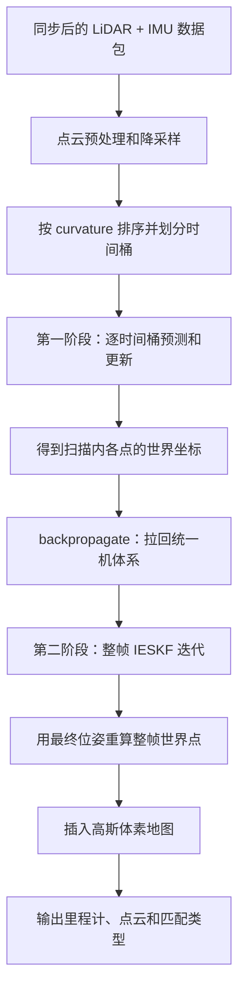

# KILO 前端漂移排查与调试变量说明

本文面向当前仓库的 `KILO` 前端实现，说明：

- 第一阶段和第二阶段分别在做什么；
- 第二阶段解决什么问题、不能解决什么问题；
- 漂移排查时应记录哪些变量；
- 每个变量的定义、单位、源码来源和异常含义；
- 如何根据变量出现异常的先后顺序定位根因。

相关源码：

- [`KILO.cc`](../legkilo/src/core/slam/frontend/KILO.cc)
- [`eskf.cc`](../legkilo/src/core/slam/frontend/eskf.cc)
- [`gaussian_voxel_map.cc`](../legkilo/src/core/slam/frontend/gaussian_voxel_map.cc)
- [`lidar_processing.cc`](../legkilo/src/preprocess/lidar_processing.cc)
- [`ros_interface.cc`](../legkilo/src/interface/ros2/ros_interface.cc)
- 更完整的前端原理说明见 [`FRONTEND_LEARNING_GUIDE_CN.md`](./FRONTEND_LEARNING_GUIDE_CN.md)

---

## 1. 排查目标：找到“第一帧坏帧”

最终地图已经拉花时，地图里通常混合了三类结果：

1. 漂移之前的正确地图；
2. 第一次错误预测或错误匹配产生的坏帧；
3. 坏帧污染地图后产生的连锁错误。

因此排查重点不是最终漂了多远，而是找到第一个满足下列任一条件的帧：

- 激光匹配率突然下降；
- IMU 或点时间间隔异常；
- IMU 预测位姿突然跳变；
- 激光更新量突然跳变；
- 速度或偏置开始持续发散；
- 信息矩阵退化；
- 低质量帧仍被插入地图。

建议所有调试量按帧写入 CSV。终端只打印报警和少量摘要，不要逐点打印，否则既影响实时性，也很难对齐故障时刻。

本文使用的字段名是**建议的调试日志字段名**，不是说当前类里已经存在全部同名成员。当前代码已经直接提供 `ProcessResult` 点数、ESKF状态和部分时间量；失败原因计数、残差分位数、退化特征值、地图插入判据等需要新增统计结构或访问接口。

---

## 2. 前端完整流程



两阶段的分工可以概括为：

| 阶段 | 处理对象 | 是否沿时间轴推进 | 是否消费 IMU | 主要作用 |
| --- | --- | --- | --- | --- |
| 第一阶段 | 同一时间桶内的一组点 | 是 | 是 | 建立扫描内运动轨迹、完成去畸变并提供较好的末状态初值 |
| 反向投影 | 第一阶段生成的世界点 | 否 | 否 | 把不同时刻的点统一到第一阶段末状态的机体系 |
| 第二阶段 | 去畸变后的整帧点云 | 否 | 否 | 使用整帧约束联合迭代修正最终位姿，提高全帧一致性和配准精度 |

---

## 3. 第一阶段是什么

第一阶段在 `KILO::process()` 中按点的 `curvature` 排序。相同 `curvature` 的点组成同一个时间桶。

对每个时间桶执行：

1. 消费时间戳小于当前桶时间的 IMU；
2. 将 ESKF 状态预测到当前桶时间；
3. 用预测位姿把当前桶点从雷达系变到机体系，再变到世界系；
4. 尝试构造 Point-to-Plane 残差；
5. P2P 失败且启用 NDT 时，再尝试 NDT；
6. 若存在有效残差，调用 `updateByPoints()` 更新 ESKF；
7. 使用更新后的位姿重算该桶点的世界坐标。

坐标变换为：

$$
\mathbf p_I=R_{I\leftarrow L}\mathbf p_L+t_{I\leftarrow L}
$$

$$
\mathbf p_W=R_{W\leftarrow I}(t)\mathbf p_I+p_{W\leftarrow I}(t)
$$

这里的位姿带有点时间 $t$，所以扫描前部和扫描后部的点使用不同的瞬时位姿。第一阶段主要解决扫描期间平台运动造成的点云运动畸变。

### 3.1 第一阶段能解决什么

- 扫描期间平移造成的墙面拖影；
- 扫描期间旋转造成的弯墙或重影；
- 给扫描末状态提供 IMU + 激光联合约束后的初值；
- 在点云逐步到达不同时间桶时维持连续状态。

### 3.2 第一阶段的局限

- 每次只使用当前时间桶内的点，约束数量可能较少；
- 更新结果可能受点的时间顺序和分桶方式影响；
- 前部点和后部点虽然各自投到了世界系，但并不是天然处于同一个机体时刻；
- 某个时间桶完全匹配失败时，预测仍然发生；
- 最后一个降采样点之后、扫描结束之前的 IMU 可能未被消费。

---

## 4. 反向投影 `backpropagate` 是什么

第一阶段结束后，每个点已经根据自己的采样时刻得到世界坐标 $\mathbf p_W$。此时使用第一阶段结束状态 $R_f,p_f$，把所有点拉回同一个机体系：

$$
\mathbf p_I^{f}=R_f^{\mathsf T}(\mathbf p_W-p_f)
$$

这里的 $\mathbf p_I^{f}$ 表示：该点经过第一阶段运动补偿后，在扫描末状态机体系中的坐标。

反向投影的作用不是优化位姿，而是进行坐标统一。它为第二阶段提供一份可以被当成“同一时刻整帧点云”的输入。

当前实现还会根据反向投影后的机体系点重新计算点测量协方差。需要注意，这份协方差是近似模型，与第一阶段“雷达协方差经过外参旋转到机体系”的路径并不完全相同。

---

## 5. 第二阶段是什么

第二阶段是 `predictUpdateCloud()` 中的整帧 IESKF 更新。

它的输入是：

- 第一阶段结束后的状态，作为迭代先验 `state_before_iter`；
- `backpropagate` 得到的统一机体系整帧点云；
- 当前帧进入系统之前已经存在的高斯体素地图。

每次迭代执行：

1. 用当前迭代位姿把整帧机体系点变换到世界系；
2. 为整帧所有点并行构建 P2P/NDT 残差；
3. 重新统计有效匹配；
4. 组装整帧观测矩阵 `H`、残差 `z` 和鲁棒方差尺度 `R`；
5. 调用 `updateByCloud()` 计算状态增量；
6. 判断旋转和平移增量是否收敛；
7. 未收敛则使用新位姿重新匹配和迭代；
8. 最后使用最终状态重算全部世界点。

第二阶段不再调用 IMU，不再沿点时间推进，也不再次进行扫描内去畸变。它假设第一阶段已经完成了运动补偿。

激光残差雅可比 `H` 只显式包含旋转和位置6列，但卡尔曼增益通过状态协方差中的互相关可以生成24维 `delta_x`，所以速度、bias、重力、`imu_a_`、`imu_w_` 也可能被间接修正。当前收敛判据只检查 `dtheta` 和 `dpos`，不会检查其余状态分量是否已经稳定。

### 5.1 第二阶段解决什么问题

第一阶段是局部时间桶更新，第二阶段则把整帧的几何约束同时用于最终位姿估计，主要解决：

- 单个时间桶点数少、约束弱的问题；
- 逐桶更新对点时间顺序较敏感的问题；
- 不同时间桶更新结果在最终扫描末位姿下不完全一致的问题；
- 单次线性化不足，需要重新匹配、重新线性化的问题；
- 最终输出点云和地图插入点需要共享同一个末状态位姿的问题。

第二阶段的 P2P 最小测量噪声为 $10^{-3}$，第一阶段为 $10^{-2}$。因此第二阶段对整帧几何约束更“紧”。

### 5.2 第二阶段不能解决什么

第二阶段不是万能恢复步骤，它不能可靠解决：

- LiDAR/IMU 时间戳错误；
- 点时间单位错误；
- 外参错误或传感器机械松动；
- 第一阶段预测已经远离正确配准吸引域；
- 场景本身缺少可观方向；
- 地图已经被坏帧污染；
- 整帧几乎没有有效匹配；
- 动态物体占比过高；
- IMU 数据尖峰、饱和或长时间丢失。

如果第一阶段完全失配，但纯 IMU 预测仍在正确位姿附近，第二阶段有可能依靠整帧匹配恢复；如果预测已经偏离太远，第二阶段也会出现零匹配或错误匹配。

### 5.3 第二阶段收敛条件

当前代码的收敛条件为：

$$
\|\delta\theta\|<0.1^\circ
$$

且：

$$
\|\delta p\|<0.1\text{ cm}=0.001\text{ m}
$$

达到条件后提前退出；如果始终不收敛，则在 `ieskf_max_iterations` 的最后一次迭代结束。

### 5.4 第二阶段配置注意事项

代码读取的配置键是：

```yaml
two_step_lidar_eskf: true
```

当前部分 YAML 写的是：

```yaml
enable_second_step_eskf: true
```

后者没有被 `KILO.cc` 读取。因为代码默认值为 `true`，当前运行中第二阶段仍会开启；但是把 `enable_second_step_eskf` 改成 `false` 并不能关闭第二阶段。

---

## 6. 建议保存的阶段位姿和事件增量

第一阶段内部是“IMU预测/更新、激光桶预测/更新”交替执行的，并不存在一个天然的“整帧所有IMU预测完、但第一阶段激光尚未更新”的 `T_after_imu_predict`。如果强行在帧末取这个名字，会把已经发生的逐桶激光更新也混在里面。

因此应保存三个真实阶段位姿，并在第一阶段内部累计两类事件增量：

| 变量 | 定义 | 用途 |
| --- | --- | --- |
| `T_frame_start` | 开始处理当前帧前的 ESKF 位姿 | 当前帧所有增量的基准 |
| `T_after_first_step` | 第一阶段实际消费的IMU和全部逐时间桶激光处理结束后的位姿 | 第一阶段最终结果；实际时刻约为最后降采样点桶时间 |
| `T_before_second_step` | 进入 `predictUpdateCloud()` 前的位姿 | 数值上与 `T_after_first_step` 相同，明确第二阶段先验 |
| `T_after_second_step` | 第二阶段整帧迭代完成后的最终位姿 | 最终发布和地图插入使用的位姿 |
| `T_predict_before[i]` / `T_predict_after[i]` | 第一阶段第 i 次 `eskfPredict()` 前后位姿 | 单独统计运动模型造成的增量 |
| `T_lidar1_before[j]` / `T_lidar1_after[j]` | 第一阶段第 j 个有效激光桶更新前后位姿 | 单独统计逐桶激光修正增量 |

由它们构造下列相对增量：

| 变量 | 建议计算 | 含义 |
| --- | --- | --- |
| `imu_predict_delta` | 每次 `T_predict_before[i]^-1*T_predict_after[i]`，再按帧统计总量和最大单次量 | IMU/运动模型贡献；不要把逐桶激光更新混入其中 |
| `first_lidar_correction` | 每个有效桶 `T_lidar1_before[j]^-1*T_lidar1_after[j]`，再按帧统计总量和最大单次量 | 第一阶段逐桶激光修正量 |
| `second_lidar_correction` | `T_before_second_step^-1*T_after_second_step` | 第二阶段整帧总修正量 |
| `final_frame_delta` | 上一帧最终位姿到当前帧最终位姿 | 实际发布的单帧运动 |

相对位姿建议统一使用：

$$
\Delta T=T_a^{-1}T_b
$$

平移记录 `translation().norm()`，旋转记录 `AngleAxis(DeltaT.rotation()).angle()` 并转换为度。

---

## 7. 帧级时间和数据量变量

| 变量 | 定义与单位 | 正常用途 | 异常说明 |
| --- | --- | --- | --- |
| `frame_id` | 前端处理帧序号，无单位 | 对齐日志、点云、轨迹和传感器数据 | 序号不连续通常表示丢包、进程重启或日志遗漏 |
| `lidar_begin_time` | 点云处理器根据消息内最小点时间得到的扫描起点，秒 | 当前扫描时间范围起点 | 回退、跳跃或与 IMU 时钟域不同会破坏同步 |
| `lidar_end_time` | 点云处理器根据消息内最大点时间得到的扫描终点，秒 | 数据包同步和输出时间戳 | 小于 begin 或突然跳变属于明确异常 |
| `scan_dt` | `lidar_end_time-lidar_begin_time`，秒 | 检查扫描周期和点时间单位 | 接近 0、突然倍增或数量级错误通常表示 `time_scale` 错误或点时间异常 |
| `imu_input_num` | `process()` 入口时该扫描包内 IMU 数量 | 判断扫描是否获得足够惯性数据 | 突降到 0 或远低于基线表示丢帧或同步问题 |
| `imu_remaining_num` | 第一阶段点时间桶处理结束后仍未消费的 IMU 数量 | 观察扫描尾部 IMU 是否被丢弃 | 持续很多或突然增多说明最后点时间明显早于扫描结束 |
| `raw_points` | 预处理后、前端降采样前点数 | 检查雷达输入、tag/range/nan 过滤 | 突降表示遮挡、丢包、过滤条件或雷达数据异常 |
| `down_points` | 前端体素降采样后点数 | 匹配率分母和每帧约束规模 | 太少会造成约束不足；突然变化可能来自量程、视场或采样模式 |
| `min_curvature` | 降采样点最小相对时间，秒 | 检查点时间起点 | 应接近 0；明显负值说明点时间计算异常 |
| `max_curvature` | 降采样点最大相对时间，秒 | 检查降采样点是否覆盖扫描尾部 | 远小于 `scan_dt` 表示降采样丢掉了扫描末点 |
| `last_bucket_time` | `begin_time+max_curvature`，秒 | ESKF 第一阶段实际推进到的最后点时刻 | 它不一定等于 `lidar_end_time` |
| `tail_gap` | `lidar_end_time-last_bucket_time`，秒 | 衡量扫描尾部没有点桶覆盖的时间 | 较大时，扫描尾部 IMU可能被同步模块取出后未消费 |
| `max_imu_gap` | 当前包相邻 IMU 时间戳的最大差，秒 | 检测惯性数据断流 | 明显大于正常 IMU 周期时，预测误差会增大 |

判断时间变量时应优先看“相对正常基线的突变”，不要直接套用固定阈值。不同雷达帧率、IMU频率和驱动打包方式对应不同正常值。

---

## 8. ESKF 预测时间变量

| 变量 | 定义与单位 | 作用 | 异常说明 |
| --- | --- | --- | --- |
| `current_time` | 当前 IMU或点时间桶的绝对时间，秒 | 本次预测目标时刻 | 必须单调不减 |
| `last_state_predict_time` | 上次传播名义状态的时刻，秒 | 计算名义状态传播间隔 | 与当前时间顺序错误会产生负 `dt_state` |
| `last_state_update_time` | 上次任意观测更新时刻，秒 | 计算协方差传播间隔 | 长时间不更新会使 `dt_cov` 和协方差增长 |
| `dt_state` | `current_time-last_state_predict_time`，秒 | 传播旋转、位置和速度名义状态 | 小于 0 是错误；突然过大表示数据间隙或时间戳跳变 |
| `dt_cov` | `current_time-last_state_update_time`，秒 | 从上次更新时刻传播协方差 | 持续变大通常说明激光/IMU更新没有发生 |
| `pos_before/after` | 预测前后位置，米 | 分离预测产生的位置变化 | 单次预测变化超出物理可能范围表示时间或速度异常 |
| `vel_before/after` | 预测前后世界速度，米/秒 | 观察加速度积分是否发散 | 无实际加速时持续增长，优先检查 IMU、重力、时间和激光失配 |
| `rpy_before/after` | 预测前后姿态欧拉角，度 | 人工查看姿态跳变 | 仅用于显示，计算增量应使用旋转矩阵或四元数，避免欧拉角奇异 |

当前实现分别传播名义状态和协方差：

```text
dt_cov -> 只传播协方差
dt_state -> 只传播名义状态
```

因此两个时间差必须分别记录，不能只打印一个 `dt`。

---

## 9. IMU 原始量、状态量和残差

### 9.1 IMU观测量

| 变量 | 定义与单位 | 作用 | 异常说明 |
| --- | --- | --- | --- |
| `raw_acc` | IMU原始三轴加速度，通常为米/秒² | 检查尖峰、饱和、轴方向和单位 | 数量级错误、单轴恒定饱和或突刺会直接影响状态 |
| `raw_acc_norm` | `raw_acc.norm()`，米/秒² | 快速检查加速度整体幅值 | 静止时应在初始化基线附近，剧烈变化应与真实运动一致 |
| `raw_gyr` | IMU原始三轴角速度，弧度/秒 | 与姿态变化交叉验证 | 单位若为度/秒但被当成弧度/秒，姿态会迅速发散 |
| `raw_gyr_norm` | `raw_gyr.norm()`，弧度/秒 | 检测旋转尖峰和静止噪声 | 静止时持续偏大表示 bias 或单位异常 |
| `imu_acc_residual` | 缩放后原始加速度减 `imu_a_` 和 `ba_`，米/秒² | IMU观测更新的新息 | 突然增大表示传感器异常、状态不一致或初始化尺度错误 |
| `imu_acc_residual_norm` | 加速度残差模长，米/秒² | 便于画时序曲线 | 长期偏大说明模型和观测不一致 |
| `imu_gyr_residual` | 原始角速度减 `imu_w_` 和 `bw_`，弧度/秒 | 陀螺观测更新的新息 | 尖峰或长期偏置表示数据或 bias 估计异常 |
| `imu_gyr_residual_norm` | 陀螺残差模长，弧度/秒 | 便于报警和统计 | 应与真实角运动和噪声水平一致 |

当前实现的 IMU 残差为：

$$
z_a=\frac{G}{\texttt{acc\_norm}}a_{raw}-a-b_a
$$

$$
z_\omega=\omega_{raw}-\omega-b_\omega
$$

### 9.2 ESKF状态量

| 变量 | 定义与单位 | 作用 | 异常说明 |
| --- | --- | --- | --- |
| `position` / `pos_` | IMU在世界系的位置，米 | 发布里程计和投影世界点 | 跳变或沿不合理方向持续增长是最终漂移的直接表现 |
| `rpy` / `rot_` | IMU到世界系姿态，建议输出度 | 人工判断 roll/pitch/yaw 漂移 | yaw 在退化场景最容易无约束漂移 |
| `quaternion_norm` | 姿态四元数模长，无量纲 | 数值健康检查 | 应接近 1；明显偏离说明旋转数值异常 |
| `velocity` / `vel_` | 世界系速度，米/秒 | 惯性预测位置的直接输入 | 激光失配后持续增长，通常会形成长直线飞走轨迹 |
| `ba` / `ba_` | 加速度计偏置状态，等效米/秒² | 解释原始加速度中的慢变偏置 | 应平滑变化；单帧跳变或持续快速增长表示滤波不稳定 |
| `bw` / `bw_` | 陀螺偏置状态，弧度/秒 | 解释原始角速度中的慢变偏置 | 异常会导致姿态尤其 yaw 持续漂移 |
| `gravity` / `grav_` | 世界系重力向量，米/秒² | 惯性速度预测 | 方向错误导致水平加速度；模长错误导致速度持续发散 |
| `gravity_norm` | `grav_.norm()`，米/秒² | 检查重力状态稳定性 | 应接近配置值 9.81；变化过大表示状态更新异常 |
| `imu_a` / `imu_a_` | ESKF中的机体系比力状态，米/秒² | 实际用于预测速度，不是直接使用 raw IMU | 与原始观测长期不一致会导致速度预测错误 |
| `imu_w` / `imu_w_` | ESKF中的机体系角速度状态，弧度/秒 | 实际用于预测姿态 | 与陀螺观测不一致会导致姿态预测错误 |

需要特别注意：当前实现的预测使用 `imu_a_` 和 `imu_w_`，不是简单使用 `raw-bias`。因此只打印原始 IMU不足以解释预测，必须同时打印这两个状态。

### 9.3 协方差变量

| 变量 | 定义与单位 | 作用 | 异常说明 |
| --- | --- | --- | --- |
| `P_rot_diag` | `P(0:2,0:2)` 对角线，弧度² | 姿态不确定度 | 暴涨表示长期缺少约束；负值、NaN、Inf 是数值错误 |
| `P_pos_diag` | `P(3:5,3:5)` 对角线，米² | 位置不确定度 | 持续增长通常伴随匹配失败 |
| `P_vel_diag` | `P(6:8,6:8)` 对角线，(米/秒)² | 速度不确定度 | 增大后位置预测也会迅速变差 |
| `P_ba_diag` | 加速度偏置协方差对角线 | 判断 bias 是否有足够约束 | 极小但 bias 错误表示过度自信；暴涨表示失去约束 |
| `P_bw_diag` | 陀螺偏置协方差对角线 | 判断角速度偏置可信度 | 与 yaw 漂移联合分析 |
| `P_min_diag` | 全状态协方差最小对角元素 | 数值健康检查 | 明显负值表示协方差更新存在数值问题 |
| `P_max_diag` | 全状态协方差最大对角元素 | 快速发现协方差发散 | 突然跨数量级增长要对齐 `dt_cov` 和匹配率 |

---

## 10. 匹配数量与匹配率

| 变量 | 定义 | 作用 | 异常说明 |
| --- | --- | --- | --- |
| `p2p_first` | 第一阶段所有时间桶有效 P2P 点数之和 | 判断逐桶匹配是否正常 | 突降说明预测、平面地图或门控异常 |
| `ndt_first` | 第一阶段所有时间桶有效 NDT 点数之和 | 判断 P2P 失败后的 NDT 回退能力 | 只有 NDT 增多可能表示平面匹配退化 |
| `p2p_second_iter[k]` | 第二阶段第 k 次迭代有效 P2P 点数 | 观察重新线性化后匹配是否改善 | 迭代中持续下降可能正在远离正确解 |
| `ndt_second_iter[k]` | 第二阶段第 k 次迭代有效 NDT 点数 | 观察整帧 NDT 匹配变化 | 突然主导时应检查平面有效率 |
| `p2p_second` | 第二阶段最后一次实际迭代的有效 P2P 点数 | 当前 `ProcessResult.p2p_count` 的实际语义 | 不能替代第一阶段统计 |
| `ndt_second` | 第二阶段最后一次实际迭代的有效 NDT 点数 | 当前 `ProcessResult.ndt_count` 的实际语义 | NDT每个匹配会产生3维残差，但这里仍按点计数 |
| `success_points` | `p2p+ndt`，匹配点/残差块数量 | 快速检查有效激光约束规模 | 它不是残差矩阵行数，因为一个 NDT 块有3行 |
| `match_ratio` | `(p2p+ndt)/down_points` | 消除每帧点数变化，便于跨帧比较 | 相对自身基线突然下降最有诊断价值 |
| `p2p_ratio` | `p2p/down_points` | 观察平面约束占比 | 下降而NDT上升，说明平面路径出现变化 |
| `ndt_ratio` | `ndt/down_points` | 观察NDT约束占比 | 长期很低可能是子体素点数或距离门控过严 |
| `unused_ratio` | `1-match_ratio` | 对应 Viewer 中白色未匹配点比例 | 接近1表示整帧几乎纯预测 |

匹配率的绝对正常值依赖场景、量程和采样方式。建议同时保存运行良好阶段的中位数，然后观察故障前后相对变化。例如从稳定的 0.5 突然降至 0.05，比单独规定“低于多少一定错误”更可靠。

---

## 11. P2P 匹配诊断变量

P2P 匹配失败不能只统计一个 `valid=false`，建议细分失败原因。

| 变量 | 定义 | 对应环节 | 异常说明 |
| --- | --- | --- | --- |
| `p2p_query_count` | 尝试构建P2P残差的点数 | P2P总输入 | 应接近降采样点数，除非P2P关闭 |
| `p2p_no_voxel` | 查询邻域中没有任何已有体素 | 体素查找 | 突增通常表示预测位姿偏移、地图容量不足或邻域太小 |
| `p2p_invalid_plane` | 找到体素但没有 `plane.valid` | 平面质量检查 | 说明地图点不足、场景非平面或平面阈值过严 |
| `p2p_gate_rejected` | 候选平面未通过 `d²<=9σ²` | 3σ门控 | 突增常见于时间、外参、去畸变或预测误差 |
| `p2p_valid` | 成功构建P2P残差的点数 | 有效观测 | 与 `p2p_first/second` 对应 |
| `p2p_distance_abs` | 点到平面的原始绝对距离 `abs(d)`，米 | 观察几何误差 | 漂移前增大说明点云与地图已开始错位 |
| `p2p_residual_abs` | 白化后的 `abs(r)`，近似无量纲 | 可跨距离比较残差 | 中位数/P95上升表示模型不一致或关联变差 |
| `p2p_score` | 候选的1维高斯概率密度 | 从邻域候选中选择最佳平面 | 只适合同一种模型内部比较，不应与NDT score直接比较 |
| `p2p_weight` | Cauchy鲁棒核权重，范围约为 `(0,1]` | 降低大残差影响 | 大量接近0表示虽然匹配有效，但实际贡献很弱 |
| `p2p_variance_scale` | `1/max(weight,1e-6)` | 写入 `pt_R` 的方差放大倍数 | 越大表示该观测越不可信 |

建议每帧对以下量输出 `mean/median/P95/max`，不要逐点打印：

```text
abs(d)
abs(r)
weight
variance_scale
```

失败计数的实现最好保证互斥。例如某点查询了多个邻域体素，最终没有成功时，应根据“到达的最深阶段”只归入一个主要失败原因，避免各类计数之和远大于查询数。

---

## 12. NDT 匹配诊断变量

| 变量 | 定义 | 对应环节 | 异常说明 |
| --- | --- | --- | --- |
| `ndt_query_count` | P2P关闭或P2P失败后尝试NDT的点数 | NDT总输入 | P2P成功的点不会再进入NDT |
| `ndt_no_voxel` | 邻域中找不到已有体素 | 体素查找 | 与预测偏移或搜索邻域过小有关 |
| `ndt_no_subgrid` | 体素存在但没有NDT子网格 | 子体素构建 | 可能是NDT未启用或地图数据不足 |
| `ndt_insufficient_points` | 子体素点数小于 `ndt_min_points` | NDT统计有效性 | 地图太稀、体素设置不合理或新区域常见 |
| `ndt_distance_rejected` | 点到子体素均值超过距离门控 | 几何门控 | 突增表示预测或去畸变误差 |
| `ndt_llt_failed` | NDT协方差LLT分解失败 | 数值检查 | 协方差非正定或正则化不足 |
| `ndt_valid` | 成功构建NDT残差的点数 | 有效观测 | 与 `ndt_first/second` 对应 |
| `ndt_raw_distance` | 点到子体素均值的欧氏距离，米 | 查看原始几何误差 | 应小于 `0.5*voxel_size` 才可能通过当前实现 |
| `ndt_residual_norm` | 白化后的三维残差模长，近似无量纲 | 比较观测相对协方差的误差 | 中位数/P95升高表示配准质量下降 |
| `ndt_score` | `-dist²` | 选择距离最近的子体素 | 越接近0越好，不应与P2P score直接比较 |
| `ndt_weight` | Cauchy鲁棒核权重 | 抑制NDT大残差 | 大量接近0表示有效匹配没有提供强约束 |

当前NDT原始距离门控为：

$$
\|p_W-\mu\|\le 0.5\times\texttt{voxel\_size}
$$

当 `voxel_size=0.5 m` 时，门控距离为 `0.25 m`。

---

## 13. IESKF 迭代变量

| 变量 | 定义 | 作用 | 异常说明 |
| --- | --- | --- | --- |
| `ieskf_iteration` | 当前第二阶段迭代编号，从0开始 | 判断收敛速度 | 正常帧通常较快收敛；持续跑满需进一步检查 |
| `ieskf_iterations_used` | 当前帧实际执行的迭代次数 | 帧级统计 | 突然增大说明初值或匹配质量变差 |
| `ieskf_converged` | 是否满足旋转和平移收敛条件 | 区分提前收敛和跑满退出 | `false` 不等于必然错误，但连续 false 很可疑 |
| `dtheta` | 当前迭代旋转状态增量，弧度；显示时可转度 | 判断迭代旋转修正幅度 | 单次很大可能是初值差或错误匹配 |
| `dpos` | 当前迭代位置状态增量，米 | 判断迭代平移修正幅度 | 大幅跳变需与残差和信息矩阵联合判断 |
| `dtheta_norm_deg` | `norm(dtheta)*180/pi`，度 | 直接对应收敛阈值 | 小于0.1度只是收敛条件之一 |
| `dpos_norm_m` | `norm(dpos)`，米 | 直接对应收敛阈值 | 当前阈值为0.001米 |
| `measurement_rows` | `p2p_valid+3*ndt_valid` | 实际观测矩阵行数 | 点数不少但行数仍可能缺少方向可观性 |
| `prior_delta_norm` | 当前迭代状态相对 `state_before_iter` 的差 | 观察迭代是否远离先验 | 持续增大且不收敛可能在错误极小值方向移动 |

应为每次迭代分别记录匹配数、残差统计、信息矩阵和 `dtheta/dpos`，否则只看最后一次结果无法知道迭代是逐步改善还是逐步恶化。

---

## 14. 可观性与退化变量

匹配数量多不等于六自由度都受到约束。例如长直走廊可能有大量墙面P2P匹配，但沿走廊方向仍然缺少约束。

使用当前迭代的观测矩阵构造：

$$
\Lambda=H^{\mathsf T}R^{-1}H
$$

其中 `H` 是 `N×6` 的旋转、位置观测雅可比，`R` 是鲁棒核处理后的对角方差尺度。

| 变量 | 定义 | 作用 | 异常说明 |
| --- | --- | --- | --- |
| `info_eigenvalues[0..5]` | `Lambda` 的6个特征值，升序 | 判断各方向的观测强度 | 一个或多个接近0表示对应组合方向弱可观 |
| `lambda_min` | 最小特征值 | 最弱观测方向强度 | 趋近0表示退化 |
| `lambda_max` | 最大特征值 | 最强观测方向强度 | 与最小值组合判断尺度差异 |
| `lambda_ratio` | `lambda_min/lambda_max` | 归一化退化指标 | 越小越退化，可先用 `1e-6` 作为报警参考 |
| `condition_number` | `lambda_max/max(lambda_min,eps)` | 信息矩阵病态程度 | 越大越不稳定，可先用 `1e6` 作为报警参考 |
| `weak_eigenvector` | 最小特征值对应的6维特征向量 | 判断退化主要发生在哪种旋转/平移组合 | 可区分 yaw、垂直或沿道路方向退化 |

旋转列和位置列单位不同，所以特征值绝对大小受尺度影响。调试时优先比较同一配置、同一数据集中的时间趋势；若要做严格退化阈值，应先对旋转和平移列做合理尺度归一化。

---

## 15. 帧间运动与激光修正变量

| 变量 | 定义与单位 | 作用 | 异常说明 |
| --- | --- | --- | --- |
| `frame_delta_translation` | 上一帧最终位姿到当前帧最终位姿的平移模长，米 | 检查发布轨迹的单帧运动 | 超过平台速度与帧周期允许范围表示跳变 |
| `frame_delta_rotation` | 上一帧到当前帧的旋转角，度 | 检查发布姿态跳变 | 应与陀螺积分大致相符 |
| `predict_delta_translation` | 当前帧预测阶段产生的平移，米 | 判断是否由速度/IMU先推飞 | 先异常则优先查时间、速度、IMU |
| `predict_delta_rotation` | 当前帧预测阶段产生的旋转，度 | 与原始陀螺积分交叉验证 | 明显不一致表示时间或 `imu_w_` 状态异常 |
| `first_update_translation` | 第一阶段全部激光更新累计平移修正，米 | 观察逐桶匹配的纠偏量 | 突然很大说明错误匹配或预测初值差 |
| `first_update_rotation` | 第一阶段全部激光更新累计旋转修正，度 | 观察逐桶姿态纠偏 | 在退化或动态场景可能异常 |
| `second_update_translation` | 第二阶段整帧迭代总平移修正，米 | 判断整帧优化对第一阶段的调整 | 长期远大于第一阶段修正说明两阶段不一致 |
| `second_update_rotation` | 第二阶段整帧迭代总旋转修正，度 | 判断整帧姿态调整 | 突然很大时检查残差和匹配对应关系 |

这些量不要用欧拉角直接相减。旋转增量应从相对旋转矩阵或四元数计算。

---

## 16. 地图状态和插入控制变量

| 变量 | 定义 | 作用 | 异常说明 |
| --- | --- | --- | --- |
| `voxel_count` | 当前高斯体素地图中的体素数 | 检查地图增长和LRU容量 | 达到 `capacity` 后会淘汰旧体素 |
| `plane_voxel_count` | 已有有效平面的体素数 | 判断P2P可用地图规模 | 很少时P2P自然难以成功 |
| `plane_valid_ratio` | 有效平面体素数/含平面统计体素数 | 观察平面地图质量 | 下降表示场景变化、坏帧污染或平面阈值不合适 |
| `ndt_active_cell_count` | 有效NDT子体素数量 | 判断NDT地图覆盖 | 太少时NDT回退能力弱 |
| `allow_map_insert` | 当前帧是否允许插入前端地图 | 防止低质量帧污染地图 | 应由匹配率、运动跳变、数值健康和退化状态综合决定 |
| `map_insert_points` | 当前实际插入点数 | 核对低质量帧是否仍入图 | 零匹配但仍大量插点是风险信号 |

当前实现中，只要输入数据包有效，最终就会执行 `insertPoints()`。即使 `success_points==0`，预测位姿下的点仍会入图。这可能产生：

```text
短暂失配
  -> 纯预测位姿出现误差
  -> 错误世界点插入地图
  -> 后续点匹配到污染地图
  -> 漂移被持续放大
```

调试阶段至少应打印：

```text
match_ratio
frame_delta_translation
frame_delta_rotation
lambda_ratio
allow_map_insert
map_insert_points
```

先记录而不要立刻用固定阈值改变算法行为。获得正常和异常数据分布后，再设计地图插入门控。

---

## 17. 相关配置参数的含义

这些是与上述观测量关系最直接的配置参数。

| 配置键 | 含义 | 调大后的主要影响 | 调小后的主要影响 |
| --- | --- | --- | --- |
| `two_step_lidar_eskf` | 是否启用第二阶段整帧IESKF | 开启整帧联合修正，计算量增加 | 关闭后只保留逐桶结果，全帧一致性下降 |
| `ieskf_max_iterations` | 第二阶段最大迭代次数 | 给难帧更多重新线性化机会，耗时增加 | 可能未充分收敛 |
| `p2plane_enable` | 是否启用点到平面残差 | 结构化场景约束更强 | 关闭后依赖NDT |
| `ndt_enable` | 是否在P2P失败后尝试NDT | 非平面区域匹配机会增加，计算量增加 | 平面失败点直接Unused |
| `voxel_size` | 高斯地图父体素尺寸，米 | 地图更粗、单体素点更多 | 地图更细，但预测稍偏更容易跨体素 |
| `nearby_type` | 0中心、1中心+6邻域、2中心+26邻域 | 搜索更稳健，计算量增加，也可能引入更多候选 | 搜索快，但预测偏差时容易 `no_voxel` |
| `planar_ratio` | 平面最小特征值占比阈值 | 更容易把体素判为平面 | 平面要求更严格 |
| `planar_thickness` | 平面厚度阈值，米 | 更厚的点集也可能成为有效平面 | 只接受更薄、更平的结构 |
| `voxel_max_num` | 单体素平面统计最大点数 | 平面可积累更多数据后冻结 | 更早冻结，降低更新成本但适应性下降 |
| `ndt_min_points` | NDT子体素最少点数 | NDT统计更稳定但可用子体素减少 | NDT更易建立但协方差可能不稳定 |
| `dept_err` | LiDAR距离噪声，米 | 点协方差增大，门控可能更宽、观测权重变化 | 门控更严，模型可能过度自信 |
| `beam_err` | LiDAR角度噪声，度 | 远距离横向协方差增大 | 模型更自信，时间/外参误差更易被拒绝 |
| `p2plane_kernel_threshold` | P2P Cauchy鲁棒核尺度 | 大残差被保留更多 | 大残差被更强抑制 |
| `ndt_kernel_threshold` | NDT Cauchy鲁棒核尺度 | NDT大残差影响增强 | NDT大残差影响减弱 |
| `imu_acc_meas_noise` | 加速度观测噪声 | 更不信任原始加速度观测 | 更信任原始加速度观测 |
| `imu_gyr_meas_noise` | 陀螺观测噪声 | 更不信任原始角速度观测 | 更信任原始角速度观测 |
| `time_scale` | 点内相对时间换算到秒的比例 | 必须与消息字段单位完全一致 | 数量级错误会直接破坏去畸变 |

参数调整应建立在日志证据上。例如 `p2p_no_voxel` 突增时可对照测试 `nearby_type`，而不是在不知道失败阶段时同时修改多个参数。

---

## 18. 建议插桩位置

| 文件与函数 | 建议采集的变量 | 说明 |
| --- | --- | --- |
| `LidarProcessing::livoxHandler()` | `lidar_begin_time`、`lidar_end_time`、原始 `offset_time` 范围、过滤前后点数 | 最早发现点时间单位、tag过滤、量程过滤和空点云问题 |
| `RosInterface::syncPackage()` | LiDAR/IMU缓存大小、`last_timestamp_imu-lidar_end_time`、每包IMU数量、首末IMU时间 | 判断数据包是否真的时间对齐 |
| `KILO::process()` 入口 | `frame_id`、扫描时间、`imu_input_num`、`raw_points`、`T_frame_start`、初始状态和协方差 | 建立当前帧调试上下文；此处先保存IMU输入数量，因为后续会 `pop_front()` |
| `KILO::eskfPredict()` | `current_time`、`dt_state`、`dt_cov`、预测前后状态、单次预测位姿增量 | 判断运动模型是否先发生异常 |
| `KILO::predictUpdateImu()` | 原始IMU、`ki_z`、更新前后 `imu_a/imu_w/ba/bw/vel` | 判断IMU新息与更新是否异常 |
| `KILO::predictUpdatePoint()` | 每个桶点数、P2P/NDT有效数、更新前后位姿、零匹配桶数 | 第一阶段诊断；建议按帧累计，不要每桶都输出终端 |
| `GaussianVoxelMap::buildPoint2PlaneResidual()` | P2P失败阶段、`d`、`sigma2`、白化残差、score | 需要新增失败原因计数接口 |
| `GaussianVoxelMap::buildNdtResidual()` | NDT失败阶段、raw distance、白化残差、LLT状态 | 需要新增失败原因计数接口 |
| `KILO::backpropagate()` | 少量抽样点反投影前后的坐标、整帧点坐标有限性 | 用于确认反向投影没有产生NaN/Inf或明显尺度错误；不建议长期逐点记录 |
| `KILO::predictUpdateCloud()` | 每次迭代匹配数、残差统计、`H/R`、信息矩阵特征值 | 第二阶段每次迭代一条记录 |
| `ESKF::updateByCloud()` | `dtheta`、`dpos`、先验差、收敛标志、更新前后状态 | 当前函数已经计算 `dtheta/dpos`，只缺输出或返回调试结果 |
| `GaussianVoxelMap::insertPoints()` 调用前 | `allow_map_insert`、最终匹配率、最终位姿增量、插入点数 | 识别坏帧污染地图 |
| `KILO::process()` 返回前 | 最终位姿、状态、协方差、三阶段增量、帧级汇总 | 写入一行 `frontend_frame.csv` |

推荐增加一个每帧重置的 `FrameDebugStats`，由第一阶段、第二阶段和地图模块填充，最后统一写CSV。统计结构至少应区分：

```text
first_step
second_step[iteration]
imu_timing
state_before_after
map_insert
```

第二阶段残差构建使用 TBB 并行。不要让多个线程直接对普通整数、`std::vector` 或分位数容器执行无锁写入，否则调试代码本身会产生数据竞争。可以选择：

- 每个点只写自己索引对应的结果，循环结束后单线程归约；
- 使用 TBB reduction/thread-local 统计；
- 只对简单计数使用原子变量，残差样本仍在循环后归约。

日志统计还应过滤 `NaN/Inf`，并额外输出非有限数数量。否则一个NaN就可能使 mean、P95、特征值等整帧统计失去意义。

---

## 19. 推荐CSV字段

第一版建议一帧一行：

```text
frame_id,
lidar_begin_time,lidar_end_time,scan_dt,
imu_input_num,imu_remaining_num,max_imu_gap,
raw_points,down_points,min_curvature,max_curvature,tail_gap,
p2p_first,ndt_first,
p2p_second_iter0,ndt_second_iter0,
p2p_second_iter1,ndt_second_iter1,
p2p_second_iter2,ndt_second_iter2,
p2p_second,ndt_second,match_ratio,unused_ratio,
p2p_no_voxel,p2p_invalid_plane,p2p_gate_rejected,
p2p_residual_median,p2p_residual_p95,p2p_weight_mean,
ndt_no_voxel,ndt_no_subgrid,ndt_insufficient_points,
ndt_distance_rejected,ndt_llt_failed,
ndt_residual_median,ndt_residual_p95,ndt_weight_mean,
predict_dt_max,dt_cov_max,
predict_dtrans_sum,predict_dtrans_max,predict_drot_sum,predict_drot_max,
first_update_dtrans_sum,first_update_dtrans_max,
first_update_drot_sum,first_update_drot_max,
second_update_translation,second_update_rotation,
frame_delta_translation,frame_delta_rotation,
pos_x,pos_y,pos_z,roll,pitch,yaw,
vel_x,vel_y,vel_z,
ba_x,ba_y,ba_z,bw_x,bw_y,bw_z,
imu_a_x,imu_a_y,imu_a_z,imu_w_x,imu_w_y,imu_w_z,
gravity_norm,
p_rot_x,p_rot_y,p_rot_z,
p_pos_x,p_pos_y,p_pos_z,
p_vel_x,p_vel_y,p_vel_z,
ieskf_iterations_used,ieskf_converged,
ieskf_last_dtheta_deg,ieskf_last_dpos_m,
lambda_min,lambda_max,lambda_ratio,condition_number,
voxel_count,plane_valid_ratio,
allow_map_insert,map_insert_points
```

如果字段过多，可以拆成三个文件：

- `frontend_frame.csv`：帧级时间、状态、位姿增量和匹配总览；
- `frontend_ieskf.csv`：每帧每次第二阶段迭代一行；
- `frontend_match.csv`：P2P/NDT失败原因和残差分位数。

---

## 20. 变量联合判断表

| 首先出现的现象 | 随后出现的现象 | 优先怀疑 |
| --- | --- | --- |
| `match_ratio` 突降 | `velocity` 增长、轨迹直线飞走 | 激光失配后只剩惯性预测 |
| `max_imu_gap` 或 `dt_state` 突增 | `predict_delta` 先异常 | IMU断流或时间戳问题 |
| `tail_gap` 和 `imu_remaining_num` 长期偏大 | 高动态转弯时开始拖影 | 扫描尾部IMU未被消费 |
| `p2p_no_voxel` 突增 | P2P/NDT同时下降 | 预测偏离地图或 `nearby_type` 太小 |
| `p2p_gate_rejected` 突增 | 残差P95上升 | 时间同步、去畸变、外参或快速运动预测误差 |
| P2P下降但NDT上升 | `plane_valid_ratio`下降 | 平面地图质量或平面判定参数 |
| 匹配数较多、残差不大 | `lambda_ratio` 接近0 | 几何退化，不是简单的匹配数量不足 |
| `predict_delta` 正常 | `first/second_lidar_correction` 突然很大 | 错误关联或激光更新数值异常 |
| 第一阶段修正正常 | 第二阶段迭代中匹配数持续下降 | 第二阶段重新匹配走向错误极小值 |
| `ba/bw` 单帧跳变 | IMU残差或协方差同时异常 | ESKF观测更新或IMU数据异常 |
| `match_ratio` 接近0 | `map_insert_points` 仍很大 | 坏帧正在污染前端地图 |
| `P_pos/P_rot` 持续增大 | `dt_cov` 持续变大 | 长时间没有有效观测更新 |

---

## 21. 建议排查顺序

### 第一步：建立正常基线

选取漂移前连续稳定的几十帧，统计：

- `scan_dt`、IMU数量和最大间隔；
- 第一、第二阶段匹配率；
- P2P/NDT残差中位数和P95；
- 单帧预测量和激光修正量；
- 速度、bias和协方差；
- IESKF迭代次数；
- `lambda_ratio`。

### 第二步：找到第一帧突变

按时间对齐曲线，标出第一个超出正常基线的变量。不要从位置已经飞走后的帧开始看。

### 第三步：判断异常发生在哪个阶段

- 预测先异常：查 IMU、状态、时间戳和 `dt`；
- 第一阶段匹配先异常：查点时间、去畸变、体素查询和P2P/NDT门控；
- 第二阶段才异常：查迭代匹配变化、更新增量和退化；
- 前两阶段都失配但仍插图：查地图污染反馈。

### 第四步：做单变量对照实验

一次只改变一个因素，例如：

- `nearby_type: 0 -> 1`；
- 正确配置键下关闭第二阶段；
- 暂停低匹配率帧地图插入；
- 固定同一段 rosbag 重放；
- 单独比较第一阶段和第二阶段输出。

对照实验仍然使用同一份 CSV 字段，才能判断变化发生在哪个环节。

---

## 22. 当前实现中必须牢记的边界

1. `ProcessResult.p2p_count/ndt_count` 在两阶段开启时只代表第二阶段最后一次迭代。
2. 第二阶段的 `match_types` 会覆盖第一阶段结果。
3. 第二阶段不消费IMU，不沿点时间推进。
4. 第一阶段最后时间桶不一定等于扫描结束时间。
5. 数据包同步取出的扫描尾部IMU可能没有在第一阶段被消费。
6. 匹配全部失败不会自动令 `ProcessResult.valid=false`。
7. 匹配全部失败时，当前预测世界点仍可能被插入体素地图。
8. `nearby_type=0` 只搜索中心体素。
9. `enable_second_step_eskf` 不是当前代码读取的第二阶段开关。
10. 匹配数量多不代表六自由度都可观，必须结合信息矩阵特征值。

---

## 23. 最小可用调试输出

如果暂时不想实现全部统计，至少逐帧输出：

```text
[FE]
frame_id/time/scan_dt
imu_input_num/imu_remaining_num/max_imu_gap/tail_gap
raw_points/down_points
p2p_first/ndt_first/p2p_second/ndt_second/match_ratio
predict_delta_translation/predict_delta_rotation
first_update_translation/first_update_rotation
second_update_translation/second_update_rotation
frame_delta_translation/frame_delta_rotation
position/rpy/velocity/ba/bw/imu_a/imu_w/gravity_norm
P_pos_diag/P_rot_diag/P_vel_diag
ieskf_iterations_used/ieskf_converged/dtheta/dpos
lambda_ratio/condition_number
allow_map_insert/map_insert_points
```

对“轨迹突然沿直线飞走”的情况，优先查看顺序为：

```text
match_ratio
  -> 第一/第二阶段是否还有激光更新
  -> predict_delta 和 velocity 是否开始增长
  -> dt_state、max_imu_gap、tail_gap 是否异常
  -> 信息矩阵是否退化
  -> 低质量帧是否仍然插图
```
