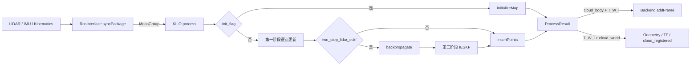
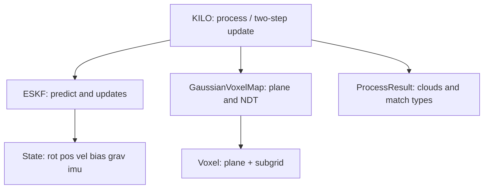
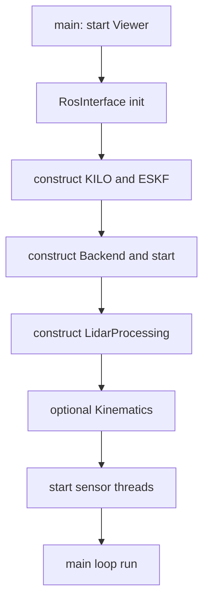
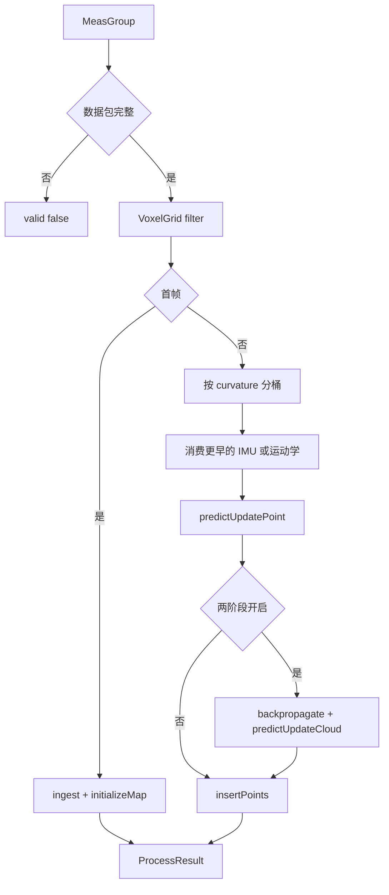
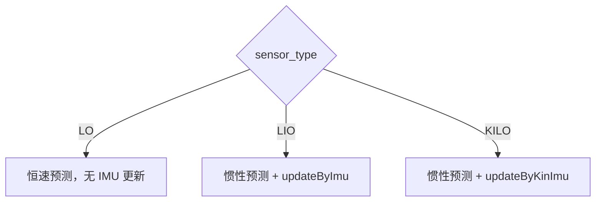

# kilo-map SLAM 前端源码学习指南

> 本文以当前仓库源码为唯一依据，面向会 C++、正在学习 SLAM 前端的读者。文中的“前端”专指 `legkilo/src/core/slam/frontend/` 及为还原完整链路而必须追踪的预处理、ROS 接口，不是 Web 前端。
>
> 源码引用均相对于 `src/kilo-map/`。阅读基线包括 `README_CN.md`、后端学习文档的对照约定、ROS 1/ROS 2 入口、`MeasGroup` 同步、`KILO`/`ESKF`/`State`/`GaussianVoxelMap`、预处理和 Viewer/后端交接；不以 `build/`、`install/`、`log/` 或无关第三方源码为依据。

## 0. 先读结论：一条闭环主链

kilo-map 前端的最短完整链路是：

1. 传感器线程把 LiDAR（及 IMU 或足式运动学）写入缓存；主循环 `RosInterface::run()` 调用 `syncPackage()`，按扫描结束时间打包成 `MeasGroup`。
2. `KILO::process()` 先体素降采样。第一帧只做重力/偏置初始化和地图插入，不跑两阶段更新。
3. 后续帧沿扫描时间轴：先消费早于当前点的 IMU/运动学，再对同一时间桶内的点做第一阶段增量 ESKF 更新，把各点投影到当时的世界系。
4. 若开启两阶段（代码默认开启），把去畸变后的世界点反向投影到当前 IMU/机体系，再对整帧做迭代 ESKF（IESKF）。
5. 用最终世界点更新高斯体素地图，生成 `ProcessResult`：`cloud_body`、`cloud_world`、`cloud_lidar` 和匹配类型。
6. 仅当 `valid == true` 时，主循环把 `cloud_body` 与 $T_{W\leftarrow I}$ 交给 `Backend::addFrame()`，并发布 ROS 里程计/TF/世界系点云。**后端优化不会回写 ESKF。**



源码依据：

- 入口：`legkilo/src/apps/leg_kilo_node.cc`、`legkilo/src/apps/leg_kilo_node_ros2.cc`。
- 同步与发布：`legkilo/src/interface/ros1/ros_interface.cc`、`legkilo/src/interface/ros2/ros_interface.cc`，`RosInterface::syncPackage()` / `run()`。
- 前端总调度：`legkilo/src/core/slam/frontend/KILO.{h,cc}`，`KILO::process()`。
- 滤波器：`legkilo/src/core/slam/frontend/eskf.{h,cc}`、`State.{h,cc}`。
- 局部地图：`legkilo/src/core/slam/frontend/gaussian_voxel_map.{h,cc}`。
- 预处理：`legkilo/src/preprocess/lidar_processing.{h,cc}`、`state_initial.hpp`、`kinematics.{h,cc}`。

**本章要点**

- 前端输出的位姿是 IMU/机体到世界的 $T_{W\leftarrow I}$，点云 `cloud_body` 在同一 IMU 系。
- 在线 ROS 里程计和后端入队都直接使用这份前端值。
- 后端只消费，不修改 `ESKF` 状态。

**自测**

1. 一帧从哪个函数进入前端，又从哪个函数交给后端？
2. 第一帧会做两阶段激光雷达更新吗？

---

## 1. 学习目标、前置知识与范围

### 1.1 学完应能回答

- `MeasGroup` 如何按扫描结束时间打包，哪些 IMU 会被丢掉？
- `curvature` 里存的是什么时间，单位是什么，量化步长是多少？
- `extrinsic_T/R` 把哪个坐标系的点变到哪个坐标系？`README_CN.md` 的表述是否与代码一致？
- `cloud_body`、`cloud_world`、`cloud_lidar` 在初始化帧和后续帧分别怎么生成？
- 24 维 `State` 各块是什么，预测用的是去偏后的原始 IMU，还是状态里的 `imu_a_`/`imu_w_`？
- 第一阶段为什么能去畸变，失败点如何跳过，第二阶段为什么要先 `backpropagate`？
- 点到平面和 NDT 残差的符号、雅可比以及 Cauchy 核如何进入观测噪声？
- `sensor_type: KILO` 时还会订阅 `imu_topic` 吗？
- 停止后前端还会被 `run()` 调用吗？

### 1.2 建议前置知识

- C++17：智能指针、互斥锁、`std::deque`、TBB `parallel_for`。
- Eigen：旋转矩阵、反对称矩阵、`Isometry3d`、右扰动 $\operatorname{Exp}/\operatorname{Log}$。
- 误差状态卡尔曼滤波（ESKF）与迭代更新（IESKF）的基本形式。
- 激光雷达运动畸变、点到平面、NDT 的直观含义。
- ROS 主循环与独立订阅线程。

### 1.3 范围边界

本文详细解释本仓库真实调用到的前端、预处理和 ROS 交接；不展开整套 Point-LIO/FAST-LIO 论文推导，也不重复后端因子图、回环和 Ceres。算法原理只讲到足以逐项对应本项目代码的程度。第三方库只解释本项目实际用到的接口。

**本章要点**

- 学习重点是“代码实际怎样做”，不是泛化的 LIO 教科书。
- 与后端文档对照时，交接面就是 `ProcessResult` 和 $T_{W\leftarrow I}$。

**自测**

1. 阅读本文前最需要掌握的变换记号是什么？
2. 为什么必须同时读 ROS 同步和 `KILO::process()`，而不能只读 `eskf.cc`？

---

## 2. 前端职责、输入与输出

### 2.1 输入来自哪里

ROS 1/ROS 2 的主循环相同：`RosInterface::run()` 先 `syncPackage()`，再 `kilo_->process(measure_)`。

`MeasGroup` 定义见 `legkilo/src/common/sensor_types.hpp`：

- `lidar_scan_`：扫描起止时间和雷达系点云；
- `imus_`：LIO 模式的 IMU 队列；
- `kin_imus_`：KILO 模式的足端+IMU 队列。

三种 `sensor_type` 互斥：

| 模式 | 解析函数 | 实际订阅 | 前端预测/更新 |
| --- | --- | --- | --- |
| `LO` | `usesLidarOnly` | 只订阅雷达 | 恒速模型，`lo_predict_*` |
| `LIO` | `usesImu` | 雷达 + `imu_topic` | 惯性预测 + `updateByImu` |
| `KILO` | `usesKinematics` | 雷达 + `kinematic_topic` | 惯性预测 + `updateByKinImu` |

源码：`common/sensor_types.hpp` 的 `usesImu/usesKinematics/usesLidarOnly`，以及 `RosInterface::initParamAndReset()`。

KILO 模式下即使 YAML 写了 `imu_topic`，也不会创建 IMU 订阅。IMU 加速度/角速度来自 `HighState`，由 `Kinematics::processing()` 填入 `KinImuMeas`。

### 2.2 前端负责什么

- 解析并过滤原始点云，保留逐点时间。
- 用静止首帧估计重力、陀螺偏置和初始旋转。
- 维护 24 维误差状态，融合 IMU 或运动学。
- 用两阶段激光观测消除扫描畸变并精化位姿。
- 增量维护混合特征高斯体素地图。
- 输出去畸变点云、有效匹配计数和前端位姿。

### 2.3 输出去向

`ProcessResult` 字段见 `KILO.h`：

- `valid`：数据包不完整则为 false，主循环直接返回。
- `cloud_world`：世界系点云，发布到 `/cloud_registered`，`frame_id=camera_init`。
- `cloud_body`：当前 IMU 系点云，交给 `Backend::addFrame()`。
- `cloud_lidar`：由 `cloud_body` 再左乘 $T_{I\leftarrow L}^{-1}$ 得到；当前 ROS 接口不发布它。
- `match_types`：每个降采样点的 `Unused/Point2Plane/Ndt`，随后端帧进入 Viewer。
- `p2p_count`/`ndt_count`/`success_pts_size`：有效匹配统计。

位姿接口：

$$
\texttt{getRotImu}()=R_{W\leftarrow I},\qquad
\texttt{getPosImu}()=p_{W\leftarrow I}
$$

$$
\texttt{getRotLidar}()=R_{W\leftarrow I}R_{I\leftarrow L},\qquad
\texttt{getPosLidar}()=p_{W\leftarrow I}+R_{W\leftarrow I}\,t_{I\leftarrow L}
$$

`getPosLidar()/getRotLidar()` 已实现，但当前 ROS/`run()` 没有调用。

### 2.4 明确不负责的事

- 不读取、不回写后端优化位姿。
- 不发布 `/cloud_registered_body`：话题已 advertise，但 `run()` 从未 `publish`。
- 不对未完成子地图或回环负责。
- 停止后 `run()` 在 `slam_stopped_` 处置立即返回，前端不再处理新帧。

**本章要点**

- 前端是在线里程计；后端是异步全局优化。
- 对外位姿语义是 IMU 到世界，不是雷达到世界。
- `cloud_body` 才是后端和 Viewer 当前帧使用的点云。

**自测**

1. KILO 模式的 IMU 从哪个话题进入滤波器？
2. `/Odometry` 发布的是前端值还是后端值？
3. `cloud_lidar` 当前会被 ROS 发出去吗？

---

## 3. 源码目录、核心类和数据关系

### 3.1 目录速查

- `legkilo/src/core/slam/frontend/KILO.{h,cc}`：一帧总调度、初始化、两阶段更新、点云输出。
- `legkilo/src/core/slam/frontend/eskf.{h,cc}`：预测、点/云/IMU/运动学更新。
- `legkilo/src/core/slam/frontend/State.{h,cc}`：名义状态、右扰动加减。
- `legkilo/src/core/slam/frontend/gaussian_voxel_map.{h,cc}`：平面/NDT 体素、残差。
- `legkilo/src/core/slam/frontend/voxel_map_utils.hpp`：点测量协方差、平面协方差累加器。
- `legkilo/src/preprocess/lidar_processing.{h,cc}`：雷达类型、时间缩放、距离过滤。
- `legkilo/src/preprocess/state_initial.hpp`：首帧重力/偏置/旋转。
- `legkilo/src/preprocess/kinematics.{h,cc}`：足式正解和接触滞回。
- `legkilo/src/interface/ros*/ros_interface.{h,cc}`：订阅、同步、发布。
- `legkilo/src/common/sensor_types.hpp`、`pcl_types.h`、`kernel.hpp`、`voxel_grid.hpp`。

### 3.2 关键数据结构

- `common::LidarScan`：`lidar_begin_time_`、`lidar_end_time_`、`cloud_`。
- `common::KinImuMeas`：时间、四足位置/速度/接触、加速度、角速度；腿顺序 **FR, FL, RR, RL**。
- `common::MeasGroup`：一帧同步包。
- `GaussPoint`：`pt` + `cov`。
- `ObsShared`：激光块 `pt_z/pt_h/pt_R`，IMU/运动学块 `ki_z/ki_h/ki_R`。
- `KNearestRes<DIM>`：残差 `r`、雅可比 `J`、`valid`、`score`。
- `ProcessResult`：对外输出。



### 3.3 线程与对象所有权

- 雷达/IMU/运动学各有独立订阅线程，缓存受 `RosInterface::mutex_` 保护。
- `KILO::process()` 只在主循环线程调用；`ESKF` 和当前帧高斯点云无内部锁。
- 第二阶段残差构建和地图编码使用 TBB，但结果写回仍由主线程组装。
- `Backend` 另有工作线程；前端只 `addFrame()` 入队。

**本章要点**

- `KILO` 是编排者，`ESKF` 持有名义状态和协方差，`GaussianVoxelMap` 持有局部地图。
- 同步缓存跨线程，滤波器状态单线程。

**自测**

1. `GaussPoint` 和 PCL `PointType` 谁真正参与残差？
2. 为什么 `ESKF` 没有自己的互斥锁？

---

## 4. 初始化与启动

### 4.1 对象创建顺序

主程序先启动 `ViewerSlamInterface`，再构造 `RosInterface` 并 `init()`：

1. 读 YAML，设置 `options::kSensorType` 和话题；
2. 构造 `KILO`（内部再构造 `ESKF`、`StateInitial`、`VoxelGrid`、`GaussianVoxelMap`）；
3. 构造 `Backend`，`setViewerInterface`，`start()`；
4. 按模式构造 `Kinematics` 和 `LidarProcessing`；
5. 启动订阅线程。

源码：`legkilo/src/apps/leg_kilo_node{,_ros2}.cc`，`RosInterface::initParamAndReset()`。



### 4.2 YAML 加载到前端对象

`KILO::initializeFromYaml()` 决定：

- 预测模型：LO 用 `PredictModelType::ConstantVelocity`，否则 `Inertial`；
- 初始化器：`StateInitialByLidar` / `StateInitialByImu` / `StateInitialByKinImu`；
- LO + `init_type=2` 时强制退回 `Identity`，并打 warning；
- 外参按行主序填入 `ext_rot_`、`ext_t_`；
- 若 `p2plane_enable` 和 `ndt_enable` 都为 false，强制打开点到平面。

### 4.3 统一坐标系记号

$$
T_{A\leftarrow B}:\quad \mathbf p_A=T_{A\leftarrow B}\mathbf p_B
$$

- $W$：前端世界系，ROS 中标为 `camera_init`；
- $I$：IMU/机体坐标系，ROS 中标为 `base`；
- $L$：激光雷达坐标系。

YAML 注释写明：

```text
Extrinsic: rigid body transform from LiDAR frame to IMU frame (T_I_L)
meaning: LiDAR coordinate system expressed in IMU coordinate system
```

代码：

$$
\mathbf p_I=R_{I\leftarrow L}\mathbf p_L+t_{I\leftarrow L}
=\texttt{ext\_rot\_}\,\mathbf p_L+\texttt{ext\_t\_}
$$

这与 `initializeMap()`、`predictUpdatePoint()`、`getRotLidar()/getPosLidar()` 完全一致。`README_CN.md` 写成“IMU 到激光雷达”与代码/YAML 相反，**以实现和 YAML 为准**。

### 4.4 首帧初始化

`KILO::process()` 在 `init_flag_==true` 时：

1. `state_initial_->ingest(measure)` 累加本包 IMU 或运动学样本；
2. 写入 `grav_`、`bw_`、`rot_`；
3. `cov_ = 1e-6 * I`；
4. `initializeMap(cloud_down_lidar)`：雷达点 → 机体系 → 世界系，插入地图；
5. `cloud_body = T_{I\leftarrow L}\,cloud_lidar`（尚未运动补偿）；
6. `last_state_predict_time_ = last_state_update_time_ = lidar_end_time_`；
7. LO 模式 `resetLoPredictInput(end_time)`；
8. `match_types` 全部为 `Unused`，`success_pts_size = down_pts_size`；
9. `init_flag_=false` 后返回。

`StateInitial` 默认 `min_samples=1`，首帧只要有样本就会被 `isReady()` 视为就绪；`KILO` 也并不检查 `isReady()`，而是无条件使用当前均值。

重力有两种：

- `InitType::Identity`：$R=I$，$\mathbf g=-\texttt{gravity}\cdot \bar{\mathbf a}/\|\bar{\mathbf a}\|$。
- `InitType::GravityAlignment`：$\mathbf g=(0,0,-G)$，$R$ 把 $-\bar{\mathbf a}$ 旋到世界 $-\mathbf e_z$。

`acc_norm_` 之后用于把 IMU 加速度缩放到 $m/s^2$：`(gravity_ / acc_norm_) * imu_acc`。

LO 初始化器把重力、偏置都设为零，旋转为单位阵；因为没有 IMU 更新，`acc_norm_` 之后也不再被使用。

### 4.5 停止

`RosInterface::stopSlam()` 先关订阅并 join 传感器线程，再 `backend_->stop()`。之后 `run()` 见到 `slam_stopped_` 直接返回，**前端不再被调用**。这与后端文档中“停止后不再 `addFrame`”一致。

**本章要点**

- 外参是 $T_{I\leftarrow L}$，不是 $T_{L\leftarrow I}$。
- 首帧建图，不做两阶段更新。
- 停止后前端主循环空转。

**自测**

1. 写出 $\mathbf p_I$ 由 $\mathbf p_L$ 计算的公式，并指出对应变量名。
2. GravityAlignment 时世界重力向量是多少？
3. 为什么 LO 模式不能使用重力对齐？

---

## 5. 单帧主流程：从 `MeasGroup` 到 `ProcessResult`

### 5.1 主循环

```text
RosInterface::run
├── slam_stopped_ ? return
├── syncPackage() ? else return
├── KILO::process(measure_)
├── valid ? else return
├── Backend::addFrame(cloud_body, T_W_I, lidar_end_time, match_types)
├── publishOdomTFPath(end_time, pos_I, rot_I)
└── publishPointcloudWorld(end_time, cloud_world)
```

主循环频率上限 5000 Hz，实际受 `syncPackage()` 是否凑齐一包限制。

### 5.2 `KILO::process()` 步骤

后续帧（`init_flag_==false`）：

1. 用 `VoxelGrid::filter` 得到 `cloud_down_lidar`；
2. 按 `curvature` 升序排序；
3. 把相同 `curvature` 的点当成同一时间桶；
4. 桶时间 `cur_point_time = begin_time + curvature`；
5. 先消费所有时间戳 **严格小于** 该桶时间的 IMU/运动学；
6. `predictUpdatePoint()`：预测 → 建残差 → 可能更新 → 用更新后位姿重算世界点；
7. 若 `two_step_lidar_eskf_`：清空 `match_types`，`backpropagate`，再 `predictUpdateCloud()`；
8. `gaussian_voxel_map_->insertPoints(*gauss_cloud_world)`；
9. LO 且本帧至少一次激光更新成功，则 `updateLoPredictInput(end_time)`；
10. 由最终世界点反变换得到 `cloud_body`、`cloud_lidar`。



### 5.3 输出点云的坐标语义

初始化帧：

- `cloud_lidar`：降采样后的原始雷达点；
- `cloud_body`：$T_{I\leftarrow L}$ 作用于上述雷达点；
- `cloud_world`：$T_{W\leftarrow I}T_{I\leftarrow L}$ 作用于雷达点。

后续帧，在两阶段开启时：

$$
\mathbf p_W=R_{W\leftarrow I}\mathbf p_I+p_{W\leftarrow I}
$$

$$
\mathbf p_I=R_{W\leftarrow I}^{\mathsf T}(\mathbf p_W-p_{W\leftarrow I})
$$

$$
\mathbf p_L=T_{I\leftarrow L}^{-1}\mathbf p_I
$$

代码对应 `KILO.cc` 末尾三次变换。此时三个点云都是**去畸变后、统一到扫描末状态**的同一组点。

两阶段关闭时，`gauss_cloud_world` 里各点仍停在各自时间桶更新后的世界坐标；再统一左乘最终 $T_{W\leftarrow I}^{-1}$ 得到 `cloud_body`。运动很大时，这份 `cloud_body` 不是严格的“同一时刻机体系点云”。

### 5.4 无效帧与空匹配

`valid=false` 仅当：

- 原始点云为空；或
- LIO 且 `imus_` 空；或
- KILO 且 `kin_imus_` 空。

日志：`Data packet is not ready`。这种帧不入后端、不发里程计。

若点云非空但全部匹配失败：`valid` 仍为 true，地图仍会插入当前预测/更新后的世界点，`success_pts_size` 可为 0。后端若收到空 `cloud_body` 会在 `addFrame()` 直接返回；降采样后若意外得到空云，主循环仍可能发布里程计。这是实现边界，不是配置项。

**本章要点**

- 主循环是“同步成功才处理，处理成功才输出”。
- 两阶段开启时，输出三份点云共享同一最终 IMU 位姿。
- 匹配失败不会把整帧标成 `valid=false`。

**自测**

1. `cur_point_time` 如何由 `begin_time` 和 `curvature` 算出？
2. 两阶段关闭时，`cloud_body` 是否一定是同一时刻的机体系点？
3. 全部点匹配失败还会更新地图吗？

---

## 6. 点云预处理与时间语义

### 6.1 雷达类型

`lidar_type` 整型对应 `common::LidarType`：Velodyne=1，Ouster=2，Hesai/Pandar=3，KITTI=4，Livox=5。当前 9 份运行 YAML 没有 KITTI。

`LidarProcessing::processing()` 按类型分流，并在末尾补 `width/height`，避免后续 PCL 变换因组织信息为 0 出错。

### 6.2 `time_scale` 与扫描起止时间

逐点原始时间先乘 `time_scale_` 变成秒。当前 YAML：

| 配置 | 雷达 | `time_scale` | 起止时间公式 |
| --- | --- | --- | --- |
| 多数 Velodyne | 1 | `1` | `header + scale * t` |
| NCLT | 1 | `1e-6` | 同上 |
| DITER Ouster | 2 | `1e-9` | `header + scale * t` |
| backpack Hesai | 3 | `1` | **直接使用** `scale * timestamp`，不加 header |
| Livox 系列 | 5 | `1e-9` | `header + scale * offset_time` |

Hesai 与另外三类不同：`lidar_begin_time_/end_time_` 就是点时间本身。这要求驱动给出的 `timestamp` 已经是绝对秒。`time_scale` 配错会让同步和去畸变整体错位。

KITTI 处理把所有点 `curvature` 置 0，起止时间都等于消息头；没有逐点时间，第一阶段无法按扫描轴去畸变。

### 6.3 `curvature` 量化

Velodyne/Ouster/Hesai/Livox：

$$
\texttt{curvature}
=\operatorname{round}\big((t-t_{\min})\cdot 500\big)/500
$$

即 **2 ms** 一档。第一阶段把同一档当成同时刻。最大量化误差约 1 ms。

点的绝对时间：

$$
t_i=\texttt{lidar\_begin\_time\_}+\texttt{curvature}_i
$$

对 Velodyne/Ouster/Livox，这近似等于 `header + 点时间`；对 Hesai，等于量化后的绝对点时间。

### 6.4 过滤规则

- 距离：`d^2 < min_range^2` 或 `d^2 > max_range^2` 丢弃。
- NaN/Inf 丢弃。
- `filter_num`：`if ((i % filter_num) || rangeCheck) continue;` 因此只保留 `i % N == 0` 的点。`N=1` 时该项不起作用。YAML 注释“number of points to filter”容易读成“丢掉 N 个点”，实际是“每 N 个点留 1 个”。
- Livox：从索引 1 开始，丢掉第 0 个点；并要求 `(tag & 0x30)` 为 `0x00` 或 `0x10`。
- ROS 2 Livox 另有 `livox_driver_version`，仅接口层把 v1 消息转成 v2 再走同一 handler。

### 6.5 体素降采样

`VoxelGrid` 在雷达系对整帧降采样，保留点的 `curvature`。

- `voxel_grid_mode=0`：`MedianRepresentative`。头文件注释写“取最接近体素中心的点”，实现是按体素键排序后取组内中间下标，**不是几何中心最近邻**。
- `voxel_grid_mode=1`：`RandomPerVoxelQuota`。当前 9 份 YAML 都是 1。点数已不超过 `target_num` 时整云拷贝；否则每体素按配额抽样，再必要时随机裁到 `overshoot * target_num`。

默认分辨率 0.5 m、目标 3000、overshoot 1.5、种子 42。

### 6.6 点测量协方差

`VoxelMapUtils::calculatePointMeasureCov(point_lidar, cov_lidar)` 按距离噪声 `dept_err` 和角度噪声 `beam_err`（度）在**雷达系**建模。第一阶段会再旋到机体系：

$$
\Sigma_I=R_{I\leftarrow L}\Sigma_L R_{I\leftarrow L}^{\mathsf T}
$$

`KILO` 头文件里的 `range_noise_`/`degree_noise_` 成员没有被赋值；真正生效的是 `VoxelMapUtils` 的静态量。

**本章要点**

- 去畸变依赖 `curvature` 和正确的 `time_scale`。
- Hesai 的时间零点与其他雷达不同。
- 降采样发生在雷达系，发生在分桶之前。

**自测**

1. `curvature=0.004` 对应相对扫描起点多少秒？
2. Hesai 的 `lidar_begin_time_` 是否等于 `header + first_point`？
3. `filter_num=4` 会留下哪些下标的点？

---

## 7. ESKF 状态、预测与协方差

### 7.1 名义状态与误差状态

`DIM_STATE = 24`。`State` 名义量和误差向量顺序一致：

| 下标 | 名义量 | 含义 |
| --- | --- | --- |
| 0–2 | `rot_` | $R_{W\leftarrow I}$ |
| 3–5 | `pos_` | $p_{W\leftarrow I}$ |
| 6–8 | `vel_` | 世界系速度 |
| 9–11 | `ba_` | 加速度计偏置 |
| 12–14 | `bw_` | 陀螺偏置 |
| 15–17 | `grav_` | 世界系重力 |
| 18–20 | `imu_a_` | 机体系比力（滤波后的加速度输入） |
| 21–23 | `imu_w_` | 机体系角速度输入 |

右扰动：

$$
R\leftarrow R\operatorname{Exp}(\delta\theta),\quad
x\leftarrow x+\delta x
$$

`State::operator-` 用 $\operatorname{Log}(R_{\text{other}}^{\mathsf T}R_{\text{this}})$，与右扰动一致。

这是 Point-LIO 风格：原始 IMU 读数并不直接进入运动学积分，而是先作为观测更新 `imu_a_`/`imu_w_`，预测再使用这两份状态。

### 7.2 预测输入

`KILO::eskfPredict(t)` 每次做两次 `predict`：

1. `dt_cov = t - last_state_update_time_`，只传播协方差；
2. `dt = t - last_state_predict_time_`，只传播名义状态。

然后 `last_state_predict_time_ = t`。这把“状态按上次预测时刻往前推”和“协方差从上次更新时刻增长”分开。

LIO/KILO 的输入：

$$
\texttt{imu\_acc}=\texttt{state.imu\_a\_},\qquad
\texttt{imu\_gyr}=\texttt{state.imu\_w\_}
$$

**不是** `raw - bias`。偏置通过 IMU 更新进入 `imu_a_/imu_w_`，不在预测里相减。

LO 的输入来自上一帧成功激光更新后估计的世界速度和机体系角速度。

### 7.3 惯性预测

名义增量 `getFunctionfInertial`：

$$
\delta\theta=\Delta t\,\boldsymbol\omega,\quad
\delta p=\Delta t\,\mathbf v,\quad
\delta v=\Delta t\big(R\mathbf a+\mathbf g\big)
$$

其中 $\boldsymbol\omega=\texttt{input.imu\_gyr}$，$\mathbf a=\texttt{input.imu\_acc}$。

误差状态转移 `getFxInertial` 的非零块：

- $F_{RR}=\operatorname{Exp}(-\Delta t\,\boldsymbol\omega)$
- $F_{R,\omega}=\Delta t\,I$（对 `imu_w_`，下标 21）
- $F_{pv}=\Delta t\,I$
- $F_{vR}=-\Delta t\,R[\mathbf a]_{\times}$
- $F_{vg}=\Delta t\,I$
- $F_{va}=\Delta t\,R$（对 `imu_a_`，下标 18）

没有“偏置直接进入旋转/速度”的经典 INS 块；`ba_/bw_` 不出现在这份 $F$ 里。

过程噪声 $Q$（惯性）只填：

- 速度：`vel_process_cov`（默认 20）
- `ba`：0.001
- `bw`：0.001
- `imu_a`：500
- `imu_w`：1000

位置、旋转、重力没有对角过程噪声。重力只能通过与速度的互相关，在后续更新中间接修正。

协方差：

$$
P\leftarrow FPF^{\mathsf T}+(\Delta t)^2 Q
$$

### 7.4 恒速预测（LO）

$$
\delta\theta=\Delta t\,\hat{\boldsymbol\omega},\quad
\delta p=\Delta t\,\hat{\mathbf v}_W
$$

$F$ 只有 $F_{RR}=\operatorname{Exp}(-\Delta t\,\hat{\boldsymbol\omega})$。$Q$ 填旋转块（`lo_imu_gyr_process_cov`）和位置块（`lo_vel_process_cov`）。这两个键**没有默认值**，LO 模式 YAML 缺失会抛异常。当前 9 份运行 YAML 都不是 LO。

`updateLoPredictInput(end_time)`：

$$
\hat{\boldsymbol\omega}=\frac{\operatorname{Log}(R_{\text{prev}}^{\mathsf T}R_{\text{cur}})}{\Delta t},\quad
\hat{\mathbf v}_W=\frac{p_{\text{cur}}-p_{\text{prev}}}{\Delta t}
$$

仅当本帧至少一次激光更新成功才刷新。

### 7.5 激光观测更新的共同形式

`updateByPoints` 只更新与 $R,p$ 相关的 6 列。按测量维数选择：

- 1 维：标量卡尔曼；
- $\le 24$：标准 $K=PH^{\mathsf T}(HPH^{\mathsf T}+R)^{-1}$；
- $>24$：信息形式，把 $H^{\mathsf T}R^{-1}H$ 加到 $P^{-1}$ 的左上 $6\times 6$。

`pt_R` 在组装时已被 Cauchy 核改写成方差尺度，对角加入 $HPH^{\mathsf T}$。

`updateByCloud` 是 IESKF：迭代中只用先验 `prior_state`（进入第二阶段前的状态）做迭代修正，协方差延迟到收敛或最后一次迭代才更新。收敛条件：

$$
\|\delta\theta\|\cdot 57.3<0.1^{\circ}
\quad\text{且}\quad
\|\delta p\|\cdot 100<0.1\,\text{cm}
$$

**本章要点**

- 预测使用的是状态中的 `imu_a_/imu_w_`，不是去偏原始读数。
- 协方差和名义状态用两个不同的 $\Delta t$。
- 激光观测的 $H$ 只有 6 列：旋转和位置。

**自测**

1. 惯性预测里加速度偏置如何影响下一时刻速度？
2. 为什么 `last_state_update_time_` 和 `last_state_predict_time_` 要分开？
3. IESKF 在第 0 次迭代和后续迭代的 $\delta x$ 公式有何不同？

---

## 8. 第一阶段逐点更新与去畸变

### 8.1 时间轴

对排序后的降采样点，相同 `curvature` 构成桶 $[i,j)$。每个桶：

1. 把所有 $t_{\text{IMU}}<t_{\text{bucket}}$ 的 IMU/运动学预测+更新掉；
2. 预测到 $t_{\text{bucket}}$；
3. 用**预测位姿**把桶内点变到世界系并建残差；
4. 若至少 1 个有效残差，`updateByPoints`，并用**更新后位姿**重算这些点的世界坐标和协方差；
5. 无效点保留预测世界坐标，不阻止同桶其他点更新。

因此每个点的世界坐标对应“该点时刻附近的 IMU 位姿”，扫描内运动被逐步吃进轨迹。这就是第一阶段能去畸变的原因。

### 8.2 点坐标链

对雷达点 $\mathbf p_L$：

$$
\mathbf p_I=R_{I\leftarrow L}\mathbf p_L+t_{I\leftarrow L}
$$

$$
\mathbf p_W=\hat R_{W\leftarrow I}\mathbf p_I+\hat p_{W\leftarrow I}
$$

世界协方差：

$$
\Sigma_W=R\Sigma_I R^{\mathsf T}
+[R[\mathbf p_I]_{\times}]P_{RR}[\cdot]^{\mathsf T}+P_{pp}
$$

后两项由 `use_state_covariance_for_lidar_points` 控制，默认 true；当前 YAML 均未写出该键。

### 8.3 观测选择

每个点先尝试点到平面；成功则记 `Point2Plane`。失败且 `ndt_enable` 时再尝试 NDT。两者都失败则该点不进入 `ObsShared`，`match_types` 保持 `Unused`。

第一阶段噪声常量：

```text
kFirstStepLidarNoise = {p2plane_meas_ratio=1.0, p2plane_min_noise=1e-2,
                        ndt_meas_ratio=10.0, ndt_min_noise=1e-2}
```

### 8.4 失败与部分成功

- 找不到有效平面/NDT 体素：跳过该点。
- 点到平面还有 $d^2>9\sigma^2$ 的门控，过门控才比较高斯概率并保留最佳邻域。
- 整桶零有效观测：不调用 `updateByPoints`，也不改 `last_state_update_time_`，但预测已经发生。
- `frame_had_lidar_update` 仅在某桶有效观测数大于 0 时置真。

### 8.5 本阶段结束后状态停在哪

状态时间约等于**最后一个降采样点**的桶时间，不一定等于 `lidar_end_time_`。降采样可能丢掉真正的扫描末点。

`syncPackage()` 已经把所有 $t\le t_{\text{end}}$ 的 IMU 放进 `measure_.imus_`。第一阶段只消费 $t<t_{\text{last bucket}}$ 的样本。介于“最后降采样点”和“扫描结束”之间的 IMU **不会被更新，也不会回到 `imu_cache_`**，本包结束后被丢弃。跨扫描、晚于上一帧 $t_{\text{end}}$ 的 IMU 仍留在缓存，供下一帧使用。

**本章要点**

- 去畸变是“预测到点时刻 → 用该时刻位姿投世界 → 立刻用该点更新”。
- 失败点不更新，但同桶成功点仍会改位姿。
- 扫描末尾一小段 IMU 可能被丢弃。

**自测**

1. 同一 `curvature` 的 10 个点会做几次 `eskfPredict`？
2. 点到平面失败后还会尝试 NDT 吗？条件是什么？
3. 为什么“扫描结束时间”不等于“状态时间”？

---

## 9. 反向投影与第二阶段 IESKF

### 9.1 开关

代码读取 `two_step_lidar_eskf`，默认 `true`。当前 9 份 YAML 写的是 `enable_second_step_eskf`，**这个键从未被读取**。因此改 YAML 不能关闭两阶段；要关必须改代码键名或增加对应 YAML 键。运行时实际一直是默认开启。

### 9.2 `backpropagate`

用第一阶段结束后的 $R,p$：

$$
\mathbf p_I\leftarrow R^{\mathsf T}(\mathbf p_W-p)
$$

然后对 $\mathbf p_I$ 重新调用 `calculatePointMeasureCov`。注意：第一阶段的机体系协方差是“雷达系协方差再旋转”；这里把**机体系点**当作测量模型的输入，且不再乘 $R_{I\leftarrow L}$。第二阶段使用的是这份近似机体系测量协方差。

这样做的目的：把各时刻世界点拉回到**同一个当前机体坐标系**，使第二阶段可以把整帧当作同一时刻的观测。

### 9.3 全帧迭代

`predictUpdateCloud()`：

1. 保存 `state_before_iter`；
2. 最多 `ieskf_max_iterations` 次（当前 YAML 均为 3）；
3. 每次用当前 $R,p$ 重算全部世界点；
4. TBB 并行建残差，噪声换为更紧的 `kSecondStepLidarNoise`（点到平面最小噪声 $10^{-3}$）；
5. `match_types` 整表重写，第一阶段的类型被覆盖；
6. `updateByCloud(..., state_before_iter, ...)`；
7. 收敛则提前退出；
8. 循环后再次用最终状态重写 `cloud_world`。

第二阶段**不再按时间预测**，也不再插入 IMU。它假设第一阶段已经把运动补偿进 `cloud_body`。

### 9.4 全帧一致性

两阶段都成功后：

- 所有输出点共享最终 $T_{W\leftarrow I}$；
- 地图插入的是这份一致世界点；
- `p2p_count/ndt_count` 以最后一次迭代为准。

若关闭两阶段，地图插入的是各桶自己的世界点，更接近“沿轨迹撒点”，输出 `match_types` 保留第一阶段结果。

**本章要点**

- 反向投影是第二阶段的前提，不是可选项中的展示步骤。
- YAML 的 `enable_second_step_eskf` 目前是无效键。
- IESKF 的先验是第一阶段结束状态，不是预测前状态。

**自测**

1. 第二阶段会不会再次调用 `eskfPredict`？
2. 为什么 `backpropagate` 之后要重算点协方差？
3. 把 YAML 里的 `enable_second_step_eskf` 改成 false，运行时两阶段会关吗？

---

## 10. 混合特征高斯体素地图

### 10.1 体素结构

世界点按 `voxel_size`（当前 YAML 0.5 m）散列。`capacity` 默认代码 1e6，YAML 均为 300000；超出时按 LRU 丢掉最旧体素。

每个 `Voxel` 可含：

- `Plane`：点到平面特征；
- `SubGrid`：NDT 子体素。

`SubGrid` 源码注释写“3x3x3 / 27”，实现是：

```text
kDim = 2
kCellNum = 8
```

即 **2×2×2=8** 个子体素。注释与实现不一致，以实现为准。

邻域 `nearby_type`：0=仅中心，1=中心+6=7，2=26 邻域+中心=27。当前 YAML 均为 0。

### 10.2 平面拟合

`Plane::addPoint` 累加 $\sum p$、$\sum pp^{\mathsf T}$ 和 `PlaneCovAccumulator`。`update()` 在下列条件拟合：

- 未初始化且点数 $\ge 5$（硬编码 `kMinPointsNumForPlaneInit`）；
- 或已初始化且自上次拟合又积累 $\ge 2$ 点。

平面有效条件：

$$
\frac{\lambda_{\min}}{\sum\lambda+\varepsilon}\le \texttt{planar\_ratio}
\quad\text{且}\quad
\lambda_{\min}\le \texttt{planar\_thickness}^2
$$

否则 `valid=false`。点数超过 `voxel_max_num`（YAML 50）后冻结，释放协方差累加器。

`planarity` 字段实际被赋成 $\lambda_{\min}$，不是上述比值。

### 10.3 点到平面残差

在邻域体素中找 `plane.valid` 的平面。符号距离 $d=\mathbf n^{\mathsf T}(\mathbf p_W-\mathbf q)$。若 $d^2>9\sigma^2$ 则拒绝。$\sigma^2$ 含平面协方差和点世界协方差。留下高斯概率最高者。

标准化残差与雅可比（右扰动，对应 `h=d`、`z=-d`）：

$$
z=-\frac{d}{\sigma_R},\quad
H_R=-\frac{\mathbf n^{\mathsf T}R[\mathbf p_I]_{\times}}{\sigma_R},\quad
H_p=\frac{\mathbf n^{\mathsf T}}{\sigma_R}
$$

$$
\sigma_R^2
=\rho_{\text{p2p}}(\sigma^2_{\text{plane}}+\sigma^2_{\text{point,body}})
+\sigma^2_{\min}
$$

再经 Cauchy 核把权重变成 `pt_R` 的方差尺度：`1 / max(weight, 1e-6)`。

### 10.4 NDT 变体残差

每个占用子体素若点数不少于 `ndt_min_points`（默认 5），且到均值距离平方不超过 $0.25\,\texttt{voxel\_size}^2$，则构建 3 维残差。选距离最近的那个子体素。

协方差：

$$
S=\rho_{\text{ndt}}\,\operatorname{reg}\Big(
\Sigma_{\text{cell}}+\bar\Sigma_{\text{noise}}+R\Sigma_I R^{\mathsf T}
\Big)+\sigma^2_{\min}I
$$

`reg` 做抖动、特征值下限和条件数限制。用 $S=LL^{\mathsf T}$ 白化：

$$
\mathbf r=-L^{-1}(\mathbf p_W-\boldsymbol\mu),\quad
H=L^{-1}\big[-R[\mathbf p_I]_{\times}\;\; I\big]
$$

### 10.5 插入时机与统计

当前帧点在**两阶段都结束后**才 `insertPoints`。因此本帧两阶段匹配的都是旧地图，不包含本帧。

`match_types` 按点记录；`success_pts_size = p2p_count + ndt_count`。两阶段开启时这些计数来自第二阶段最后一次迭代。

**本章要点**

- 地图是世界系高斯体素，不是后端子地图 PCD。
- 点到平面优先，NDT 是回退。
- 子体素是 2×2×2，不是注释里的 3×3×3。

**自测**

1. 平面无效时，同一体素的 NDT 还能用吗？
2. `nearby_type=0` 会搜索相邻体素吗？
3. 本帧点什么时候进入地图，第一阶段能匹配到它们吗？

---

## 11. IMU 与可选运动学融合

### 11.1 何时用哪种路径



三种模式不会叠加。

### 11.2 IMU 更新

`predictUpdateImu`：

$$
\mathbf z_a=\frac{G}{\|\bar{\mathbf a}_0\|}\mathbf a_{\text{raw}}-\mathbf a-\mathbf b_a
$$

$$
\mathbf z_w=\boldsymbol\omega_{\text{raw}}-\boldsymbol\omega-\mathbf b_w
$$

$H$ 在实现里被简化为：同时观测 $(\mathbf a+\mathbf b_a)$ 和 $(\boldsymbol\omega+\mathbf b_w)$，对应下标 9–14 与 18–23。`updateByImu` 利用这个稀疏结构直接取协方差块。

测量噪声来自 `imu_acc_meas_noise`、`imu_gyr_meas_noise`（当前 YAML 普遍 0.1 和 0.01），对角写入 `ki_R`。没有 YAML 单位注释；从残差形式看，加速度已缩放到与 `gravity_` 相同的 $m/s^2$ 量级，角速度是消息原始单位（通常 rad/s，但代码不做单位检查）。

`redundancy=true` 时，若连续两帧加速度 z 和角速度 z 完全相等，回调直接丢弃。这是为了处理“500 Hz 发布、实际 50 Hz 更新”的足式数据集。

### 11.3 运动学更新

`Kinematics` 把 Unitree 腿序 FL/FR/RL/RR 映射到本项目 FR/FL/RR/RL，用滞回阈值判断接触，并用解析雅可比计算足端位置和速度。足端量在**机体/IMU 系**。

接触足的速度观测（世界系足端速度应为 0）：

$$
\mathbf z_v=-\mathbf v-R\big(\boldsymbol\omega\times \mathbf r+\mathbf v_r\big)
$$

对应 $H$：

- 旋转：$-R[\boldsymbol\omega\times\mathbf r+\mathbf v_r]_{\times}$
- 速度：$I$
- `imu_w_`：$-R[\mathbf r]_{\times}$

非接触足不进入残差。`kin_meas_noise` 只在 `legkilo_go1_velodyne.yaml` 中显式给出，值为 0.5。

IMU 六维部分与 LIO 相同，仍包含在同一次 `updateByKinImu` 里。

### 11.4 外参只作用于激光点

IMU 和足端量都已经在机体/IMU 系，不乘 `ext_rot_/ext_t_`。外参只用于 $\mathbf p_L\to\mathbf p_I$。

**本章要点**

- LIO 和 KILO 共用惯性预测，更新方程不同。
- KILO 不订 `imu_topic`。
- 接触观测把足端速度约束到零，而不是直接观测机体速度计。

**自测**

1. 写出接触足残差，并指出 $R$ 是哪两个坐标系之间的旋转。
2. `redundancy` 比较的是哪些轴？
3. 外参会作用到足端位置吗？

---

## 12. 输出如何进入后端、Viewer 和 ROS

### 12.1 后端

仅 `process_result.valid==true` 时：

```text
backend_->addFrame(
    cloud_body,
    makeIsometry3d(getRotImu(), getPosImu()),
    lidar_end_time,
    match_types)
```

点满足 $\mathbf p_W=T_{W\leftarrow I}\mathbf p_I$。后端把这份前端绝对位姿当作关键帧/子地图原点的来源，优化后只改 `origin_opti_`，不改 `ESKF`。细节见后端学习文档。

空点云在 `Backend::addFrame()` 被丢弃，但前端仍可能已经发布了里程计。

### 12.2 Viewer

前端不直接调用 Viewer。后端工作线程在关键帧判断之前调用 `insertCurrentKeyframe(...)`，把 `cloud_body` 转成向量和 `match_types` 投递到 Viewer 线程。因此 Viewer“当前关键帧”实际是每个有效前端帧。显示层可用最近完成子地图的前后端差值做刚体对齐，这只影响绘制。

### 12.3 ROS

`publishOdomTFPath`：

- `/Odometry`：`camera_init` → `base`，位姿是前端 IMU 位姿；
- TF：同对；
- `/path`：累积前端位姿。

`publishPointcloudWorld` 发布 `/cloud_registered`。`/cloud_registered_body` 已创建发布器，当前没有发送。

时间戳一律用 `lidar_end_time_`，即使 ESKF 实际停在更早的最后点时刻。

### 12.4 前端值清单

以下始终是前端量：

- `ESKF` 的 $R,p,v$ 和协方差；
- ROS `/Odometry`、TF、`/path`、`/cloud_registered`；
- 交给后端的 `cloud_body` 和入队位姿；
- `match_types`。

后端优化后的轨迹、子地图模型和导出地图不是前端状态。

**本章要点**

- 后端、Viewer、ROS 三路都读前端，但只有后端异步改自己的优化副本。
- 发布时戳是扫描结束时间。
- body 点云话题目前是空壳。

**自测**

1. Viewer 从哪个线程拿到当前帧点云？
2. 回环成功后 `/Odometry` 会跳变吗？
3. 为什么 odom 时戳可能和最后一次 `eskfPredict` 的时间不同？

---

## 13. YAML 配置：默认值、单位与真实使用位置

读取规则与后端相同：`YamlHelper::get(key, default)` 缺键时用默认值；无默认版本缺键会抛异常。

### 13.1 模式、话题、初始化

- `sensor_type`：无默认；`LO/LIO/KILO`。
- `lidar_topic`：无默认。
- `imu_topic`：仅 LIO 必需。
- `kinematic_topic`：仅 KILO 必需。
- `redundancy`：默认 false；`legkilo_go1` 为 true。
- `gravity`：默认 9.81。
- `init_type`：默认 1；`2` 才是 GravityAlignment。NCLT/legkilo 为 1，其余多为 2。
- `livox_driver_version`：仅 ROS 2 读取，默认 2；`stairs_gamma.yaml` 为 1。

### 13.2 外参与雷达

- `extrinsic_T` / `extrinsic_R`：无默认；$T_{I\leftarrow L}$，`ext_R` 行主序 9 个数。
- `lidar_type`、`time_scale`：无默认。
- `min_range`：接口默认 0.1 m，YAML 常见 0.7–1.5 m。
- `max_range`：接口默认 100 m，YAML 常见 150 m。
- `filter_num`：默认 1；`stairs_gamma` 为 4。

### 13.3 降采样与地图

- `voxel_grid_resolution`：无默认，YAML 均为 0.5 m。
- `voxel_grid_mode`：默认 1。
- `voxel_grid_target_num`：默认 2000，YAML 均为 3000。
- `voxel_grid_overshoot`：默认 1.5。
- `voxel_size`、`dept_err`、`beam_err`：无默认。`dept_err`→距离噪声，`beam_err`→角度（度）。
- `capacity`：代码默认 1e6，YAML 300000。
- `nearby_type`：默认 0。
- `voxel_max_num`：默认 50。
- `planar_ratio`：默认 0.1。
- `planar_thickness`：默认 0.05 m，YAML 均为 0.1 m。
- `p2plane_enable`：默认 true。
- `ndt_enable`：默认 false，YAML 均为 true。
- `ndt_min_points`：默认 5。
- `ndt_jitter` / `ndt_eigenvalue_regularization` / `ndt_min_eigenvalue` / `ndt_max_condition`：当前 YAML 未写，用代码默认。

### 13.4 ESKF

- `two_step_lidar_eskf`：代码默认 true；**YAML 未使用该键**。
- `enable_second_step_eskf`：9 份 YAML 都有，**代码未读**。
- `ieskf_max_iterations`：默认 3，YAML 均为 3。
- `use_state_covariance_for_lidar_points`：默认 true，YAML 未写。
- `imu_acc_meas_noise` / `imu_gyr_meas_noise`：无默认，YAML 普遍 0.1 / 0.01。
- `kin_meas_noise`：KILO 无默认；只有 `legkilo_go1_velodyne.yaml` 写了 0.5。
- `p2plane_kernel_threshold` / `ndt_kernel_threshold`：默认 5.0。NCLT/Livox 等部分文件把点到平面核改成 3.0。
- `vel_process_cov` 等过程噪声：YAML 均未写，使用 20 / 500 / 1000 / 0.001 / 0.001。
- `lo_vel_process_cov` / `lo_imu_gyr_process_cov`：LO 必需，当前配置用不到。

### 13.5 已读取但无效、或注释不准的键

1. `enable_second_step_eskf`：写了但未读。
2. `README_CN.md` 的外参方向与 YAML/代码相反。
3. `kf_max_num_submap` 等后端注释问题见后端文档，前端不使用。
4. `SubGrid` 注释 3×3×3 与实现 2×2×2 不符。
5. `VoxelGrid` 中值模式注释与实现不符。
6. `KILO` 的 `range_noise_`/`degree_noise_` 成员、`RosInterface::init_flag_`、`ESKF::init_state` 当前未使用。
7. `/cloud_registered_body` 发布器未使用。

**本章要点**

- 运行时两阶段开关以代码默认值为准，不以 YAML 的 `enable_second_step_eskf` 为准。
- 过程噪声全部走代码默认值。
- 外参和 `time_scale` 是最容易配错、且没有默认值的两项。

**自测**

1. 当前 NCLT 配置的 `init_type` 和 `time_scale` 是多少？
2. 想关闭两阶段，改哪个键才有效？
3. `beam_err=0.1` 的单位是什么，写进哪个静态变量？

---

## 14. 两次完整实例推演

### 14.1 普通静态/低动态帧

假设 LIO、已完成初始化、`two_step_lidar_eskf=true`（代码默认）、机体几乎静止、扫描 100 ms、降采样后 3 个点时间分别为 $t_0,t_0+0.05,t_0+0.10$，中间有若干 IMU。

1. `syncPackage` 等到最后 IMU 时间 $\ge t_{\text{end}}$，把扫描内 IMU 全部移入 `measure_.imus_`。
2. 降采样、按 `curvature` 排序，三个点各成一桶。
3. 第一桶：先把 $t<t_0$ 的 IMU 更新掉，预测到 $t_0$。三点附近几乎不动，点到平面成功，ESKF 只做很小的 $R,p$ 修正，世界点重算后几乎仍在原地。
4. 第二、三桶同样。`last_state_predict_time_` 最后等于第三点时间。
5. `backpropagate`：世界点拉回当前机体系，与用 $T_{I\leftarrow L}$ 直接变过去几乎相同，因为运动很小。
6. IESKF 1–3 次，$\delta\theta,\delta p$ 很快低于 0.1°/0.1 cm，协方差在收敛时更新。
7. 三点插入旧地图对应体素；若体素已冻结则平面不再变，NDT 子体素仍可累加。
8. `ProcessResult.valid=true`，`cloud_body` 交给后端，`/Odometry` 几乎不动。

### 14.2 高动态扫描去畸变

假设足式 KILO 模式，扫描期间机体绕 z 转过约 20°，并前移 0.15 m。取扫描起点雷达点 $\mathbf p_L=[5,0,0]^{\mathsf T}$，外参 $t_{I\leftarrow L}=[0,0,0.2]^{\mathsf T}$，$R_{I\leftarrow L}=I$。

第一阶段：

1. 该点落在扫描前部时间桶。当时 $R\approx I$，$\mathbf p_I=[5,0,0.2]^{\mathsf T}$，$\mathbf p_W$ 接近这个值。
2. 后续桶里 IMU/接触足不断更新 `imu_w_` 和速度，预测把 $R,p$ 转到扫描末姿态 $R_{\text{end}},p_{\text{end}}$。
3. 同一物理墙面的后部点用 $R_{\text{end}}$ 投影，不会再被当成“雷达系里转过 20° 的歪墙”。
4. 若某点附近没有有效平面，该点不更新，但已经完成的预测仍改变后续桶的起点。

第二阶段：

1. `backpropagate` 把前部点的世界坐标乘 $R_{\text{end}}^{\mathsf T}$，得到与后部点同一机体系下的去畸变点。
2. IESKF 用整帧一致观测再微调最终 $T_{W\leftarrow I}$。
3. 输出 `cloud_body` 不再带扫描内旋转拖影；后端收到的也是这份去畸变机体云。

若错误地把外参理解成 $T_{L\leftarrow I}$，$\mathbf p_I$ 会变成 $[5,0,-0.2]$ 或被旋转错，第一帧地图就会整体偏到雷达系，后续残差会系统性偏大。这是可以用首帧 `cloud_body.z` 是否普遍比 `cloud_lidar.z` 高约 0.2 m 来核对的。

### 14.3 其他路径

- **初始化未完成/首帧**：只建图，不更新，`match_types` 全 `Unused`。
- **无效包**：缺 IMU 或空云，`valid=false`。
- **无 IMU 的 LO**：桶之间只用恒速预测；当前仓库 YAML 未启用，过程噪声键还缺失。
- **两阶段关闭**（需代码键）：地图沿轨迹插入各时刻世界点，输出 `cloud_body` 用最终位姿反变换，高动态时不一定自洽。
- **停止**：`run()` 不再进入 `process()`。

**本章要点**

- 低动态时两阶段几乎重复同一组观测；高动态时第一阶段负责时间轴，第二阶段负责整帧一致。
- 外参方向错误会在首帧 `cloud_body` 上直接暴露。

**自测**

1. 高动态例子中，扫描前部点在 `backpropagate` 前后分别在哪个坐标系？
2. 首帧 `ext_t_z=0.2` 时，静止水平点的 `cloud_body.z` 应大致怎样变？
3. 缺 IMU 的 LIO 包会进入后端吗？

---

## 15. 调试指南、阅读路线、自测与术语表

### 15.1 推荐断点

同步：

- `RosInterface::syncPackage()`：`lidar_end_time_`、`imus_.size()`、`lidar_push_`；
- 各回调里时间回退清缓存处。

预处理：

- `LidarProcessing::*Handler`：`first_point_time`、`curvature`、留下的点数；
- `VoxelGrid::filter` 前后点数。

初始化：

- `StateInitial::ingest`、`gravityVec/initRotation`；
- `KILO::initializeMap`。

第一阶段：

- `predictUpdateImu` / `predictUpdateKinImu`；
- `eskfPredict` 的两个 `dt`；
- `predictUpdatePoint` 里 `p2p_result.valid` 和 `updateByPoints`。

第二阶段：

- `backpropagate` 前后同一点的 `pt`；
- `updateByCloud` 的 `dtheta/dpos` 和 `flag_converge`。

地图：

- `Plane::fit` 的 `planar_ratio`/`valid`；
- `buildNdtResidual` 的 `cell.count` 和 `dist2`；
- `insertPoints` 的 LRU `capacity`。

输出：

- `ProcessResult` 填充处；
- `Backend::addFrame`；
- `publishOdomTFPath`。

### 15.2 建议观察量

- 缓存：`lidar_cache_.size()`、`imu_cache_.size()`、`last_timestamp_imu_ - lidar_end_time_`。
- 时间：`begin/end`、最后桶时间、剩余未消费 IMU 数。
- 状态：`rot_/pos_/vel_/ba_/bw_/imu_a_/imu_w_`、`acc_norm_`。
- 匹配：`p2p_count`、`ndt_count`、`success_pts_size/down_pts_size`。
- 迭代：IESKF 次数、$\|\delta\theta\|$、$\|\delta p\|$。
- 地图：体素数、平面 `valid` 比例、子体素占用。

`LOG_EVERY_N(INFO, 20) << process_result` 已打印有效标志和点数统计。`Timer::logAllAverTime()` 在进程退出时打印 `Downsampling`、`State predict/update - 1st/2nd`、`Backpropagate`、`Voxel map update`、`Lidar Processing` 的平均耗时。

### 15.3 常见现象定位

**一直 `Data packet is not ready`**

- LIO：IMU 缓存是否为空，或雷达已到但 IMU 时间还没超过 `lidar_end_time_`；
- KILO：是否订错成 `imu_topic` 而不是 `kinematic_topic`；
- `time_scale` 是否把结束时间推到未来很远处。

**轨迹立刻飞掉**

- 外参方向或 `extrinsic_R` 行主序；
- IMU 单位是否已经是 $m/s^2$，`acc_norm_` 是否异常；
- 是否未静止初始化；
- `init_type=1` 时世界系会跟着首帧机体倾斜。

**结构化场景匹配很少**

- `planar_thickness`/`planar_ratio` 过严；
- `nearby_type=0` 且点落在邻体素；
- `dept_err/beam_err` 过小导致 3$\sigma$ 门控过严。

**非结构化场景只有 NDT 或几乎无匹配**

- 确认 `ndt_enable` 实际为 true；
- `ndt_min_points` 和 0.5 个体素的距离门；
- 子体素是 8 格不是 27 格，过大 `voxel_size` 会让子格很粗。

**去畸变残留拖影**

- 逐点时间是否全是 0（KITTI 或 `time_scale` 错误）；
- 最后点远早于 `lidar_end_time_`，中间 IMU 被丢；
- 误以为改 `enable_second_step_eskf` 能开关第二阶段。

**设置了 body 点云话题但 RViz 没有**

- 发布器存在，`run()` 未发布；请看 `cloud_world` 或 Viewer。

### 15.4 源码证实的风险/不一致

1. YAML `enable_second_step_eskf` 与代码 `two_step_lidar_eskf` 键名不一致。
2. `README_CN.md` 外参方向与 YAML/实现相反。
3. `SubGrid` 注释 3×3×3，实现 2×2×2。
4. `MedianRepresentative` 注释与中位下标实现不符。
5. 扫描末、最后降采样点之后的 IMU 被丢弃。
6. `/cloud_registered_body`、`getPosLidar()/getRotLidar()` 当前输出路径未用。
7. `backpropagate` 的点协方差模型与第一阶段不一致。
8. 平面 `planarity` 存的是 $\lambda_{\min}$。
9. LO 模式未被当前 YAML 使用，且过程噪声键无默认值。
10. 主循环在 `valid=true` 但点云为空时仍可能发里程计。

### 15.5 行为、原理、改进的边界

**当前行为**已按源码写出。

**原理解释**只用于说明为何沿时间轴更新能去畸变、为何 IESKF 需要统一机体系、为何 IMU 被当成状态而不是直接积分。

**可选改进（当前未实现）**

- 统一 YAML 与代码的两阶段键名；
- 修正 README 外参方向；
- 消费或归还扫描末剩余 IMU；
- 发布 `cloud_body` 或删除空发布器；
- 第二阶段协方差继续使用第一阶段的 $\Sigma_I=R_{I\leftarrow L}\Sigma_L R^{\mathsf T}$；
- 给过程噪声、`time_scale`、外参做构造期校验；
- 修正 `SubGrid`/中值降采样注释，或改成与注释一致的实现。

### 15.6 分阶段阅读路线

**阶段一：入口和同步**

1. `README_CN.md`（外参以代码为准）
2. `leg_kilo_node_ros2.cc` 或 ROS 1 对应文件
3. `ros_interface.cc::init/run/syncPackage`
4. `sensor_types.hpp`

目标：画出三种 `sensor_type` 的订阅和打包条件。

**阶段二：点云时间**

1. `lidar_processing.cc` 五种 handler
2. `voxel_grid.hpp`
3. `KILO.cc` 里 `time_list` 排序和分桶

目标：对一种真实 YAML 手算某个点的 `cur_point_time`。

**阶段三：状态和预测**

1. `State.{h,cc}`
2. `eskf.cc::getFunctionf*/getFx*/predict`
3. `KILO.cc::eskfPredict`

目标：写出 24 维顺序，并说明两个 $\Delta t$。

**阶段四：两阶段激光**

1. `predictUpdatePoint`
2. `backpropagate`
3. `predictUpdateCloud` + `updateByCloud`
4. `gaussian_voxel_map.cc` 两个 `build*Residual`

目标：用 $T_{A\leftarrow B}$ 证明去畸变和反向投影。

**阶段五：交接**

1. `ProcessResult` 填充
2. `Backend::addFrame`
3. `publishOdomTFPath`
4. 后端文档第 2 章

目标：列出哪些量永远是前端值。

### 15.7 练习

**练习 A：外参方向**

取 $R=I,t=[0,0,0.2]$，雷达点 $(5,0,0)$，手算 $\mathbf p_I$，再对照 `initializeMap()`。

**练习 B：时间量化**

$t-t_{\min}=0.0072$ s，计算 `curvature` 和量化误差。

**练习 C：残差符号**

平面法向 $(0,0,1)$，点在平面上方 0.1 m，写出 $z$ 的符号，并说明位置沿 $+z$ 更新时残差如何变。

**练习 D：同步窗口**

扫描 $[10.00,10.10]$，IMU 时刻 `{9.99,10.05,10.10,10.11}`。哪些进入本包？第一阶段若最后点在 10.098，哪些会被丢弃？

**练习 E：模式对照**

对照 `legkilo_go1_velodyne.yaml`，列出实际订阅的话题，并说明 `imu_topic` 是否生效。

### 15.8 综合自测题

1. `syncPackage` 在 LIO 下返回 true 的时间条件是什么？
2. KILO 模式会调用 `predictUpdateImu` 吗？
3. `curvature` 的量化步长是多少秒？
4. Hesai 的扫描时间零点与 Velodyne 有何不同？
5. $T_{I\leftarrow L}$ 在代码里的两个变量名是什么？
6. `cloud_body` 在后续帧是如何从世界点算出来的？
7. 24 维状态里 `imu_a_` 的下标是什么？
8. 惯性预测是否做 $\mathbf a_{\text{raw}}-\mathbf b_a$？
9. 第一阶段一个时间桶会预测几次？
10. 点到平面残差 $z$ 和距离 $d$ 的关系是什么？
11. 第二阶段的 `match_types` 会保留第一阶段结果吗？
12. `SubGrid` 实际有多少个子体素？
13. 本帧点能否在本帧第一阶段被匹配到？
14. 接触足观测约束的是哪个速度？
15. 后端优化是否改 `eskf_->state().pos_`？
16. `/cloud_registered_body` 当前有数据吗？
17. 改 `enable_second_step_eskf: false` 会怎样？
18. LO 模式缺少 `lo_vel_process_cov` 会怎样？
19. 停止后 `KILO::process` 还会被调用吗？
20. `backpropagate` 重算协方差时有没有再乘 `ext_rot_`？

### 15.9 综合题简答

1. 雷达缓存与 IMU 缓存均非空，且最新 IMU 时间 $\ge$ 当前扫描结束时间。
2. 不会；KILO 走 `predictUpdateKinImu`。
3. 0.002 s。
4. Hesai 直接用点时间，不加消息头。
5. `ext_rot_` 和 `ext_t_`。
6. 左乘最终 $T_{W\leftarrow I}^{-1}$。
7. 18–20。
8. 否，预测用 `state.imu_a_`。
9. 一次（整桶共享）。
10. $z=-d/\sigma_R$。
11. 不会，整表重写。
12. 8。
13. 不能，插入发生在两阶段之后。
14. 世界系足端速度，期望为 0。
15. 不改。
16. 没有，发布器未使用。
17. 无效果，代码不读该键。
18. `YamlHelper::get` 抛异常。
19. 不会，`run()` 先返回。
20. 没有。

### 15.10 术语表

- **Frontend（前端）**：本项目中以 ESKF 和局部高斯体素地图产生逐帧里程计的模块。
- **Backend（后端）**：子地图因子图与回环，不回写前端。
- **MeasGroup（测量组）**：一次同步后的雷达扫描加 IMU 或运动学队列。
- **ESKF（误差状态卡尔曼滤波）**：在 24 维误差向量上做预测和更新。
- **IESKF（迭代 ESKF）**：第二阶段对同一先验反复线性化激光观测。
- **Two-step lidar update（两阶段激光更新）**：先沿时间轴逐点更新，再反向投影后全帧迭代。
- **Backpropagate（反向投影）**：把各时刻世界点变回当前机体系。
- **Undistortion（去畸变）**：消除一帧扫描期间运动造成的点云扭曲。
- **$T_{I\leftarrow L}$**：把雷达点变到 IMU/机体系的外参，代码 `ext_rot_/ext_t_`。
- **cloud_body / cloud_world / cloud_lidar**：IMU 系、世界系、雷达系点云。
- **curvature**：PCL 字段，这里被复用为相对扫描起点的量化秒。
- **GaussPoint**：带三维协方差的点。
- **Point-to-plane（点到平面）**：用体素平面法向和中心构造一维残差。
- **NDT 变体**：用子体素高斯均值/协方差构造三维白化残差。
- **Process noise $Q$**：预测时加到协方差上的过程噪声。
- **Cauchy kernel（柯西核）**：把大残差权值压低，并转化成更大的观测方差。
- **KILO mode**：雷达 + 足式运动学（含 IMU）融合，不是“只用雷达”。
- **LO mode**：仅雷达的恒速前端；当前运行 YAML 未启用。
- **camera_init / base**：ROS 世界系与 IMU 系的 frame id。

**本章要点**

- 调试时间轴时要同时看同步窗口、`curvature` 和两个 `last_state_*_time_`。
- 已列风险都有源码证据；改进项不是仓库现有功能。
- 综合题覆盖入口、坐标、状态、两阶段、地图、融合、输出和配置。

**自测**

1. 你能否不看答案画出主线程与三个订阅线程的数据流？
2. 你能否用一个带 z 平移的外参例子证明 $T_{I\leftarrow L}$？
3. 你能否列出至少三项“当前代码行为”和“可选改进”的区别？

---

## 附录 A：主调用链索引

```text
main
└── ViewerSlamInterface::start
└── RosInterface::init
    ├── KILO::KILO / initializeFromYaml
    │   ├── ESKF
    │   ├── StateInitial*
    │   ├── VoxelGrid
    │   └── GaussianVoxelMap
    ├── Backend::start
    ├── LidarProcessing
    ├── [optional] Kinematics
    └── subscribe threads

RosInterface::run
├── syncPackage
└── KILO::process
    ├── VoxelGrid::filter
    ├── [first frame] StateInitial::ingest + initializeMap
    └── [later frames]
        ├── predictUpdateImu / predictUpdateKinImu
        ├── predictUpdatePoint
        │   ├── eskfPredict
        │   ├── buildPoint2PlaneResidual / buildNdtResidual
        │   └── ESKF::updateByPoints
        ├── [optional] backpropagate
        ├── [optional] predictUpdateCloud + ESKF::updateByCloud
        └── GaussianVoxelMap::insertPoints
└── Backend::addFrame
└── publishOdomTFPath / publishPointcloudWorld
```

## 附录 B：仍需运行实验才能确认的事项

下列内容无法仅凭当前源码静态确认，本文没有把它们写成事实：

1. 各数据集上最合适的 `voxel_size`、核阈值、IMU 噪声和过程噪声数值；当前过程噪声全部使用代码默认值，没有随仓库 YAML 调过。
2. 真实 IMU 消息到底是 $m/s^2$ 还是 g；代码用 `acc_norm_` 做比例缩放，效果取决于数据。
3. 扫描末被丢弃的那一小段 IMU 在各雷达频率下的实际时长和影响。
4. LO 模式在本仓库数据集上的可用性；YAML 注释已写明未经充分测试。
5. 2×2×2 子体素在不同 `voxel_size` 下的经验表现。
6. TBB 线程数和第一/第二阶段的真实耗时；只有退出时的平均 Timer 日志，没有固定性能数字。
7. 异常退出、时钟回跳清缓存后，重新对齐需要多少帧；代码只保证回跳时清空对应缓存。
